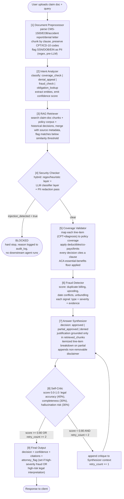

# Agent Architecture

## 1. Agent diagram

## 2. Agent responsibility & state-ownership table

The state-overwrite failure mode the spec warns about ("no agent re-fetches data that a previous agent already produced") is prevented structurally: `GraphState` is namespaced by agent, and each agent's node function is only permitted to return updates to its own namespace. This table is the contract every node implementation is checked against.

| # | Agent | Reads from state | Writes to state (owns) | Node type |
|---|---|---|---|---|
| 1 | Document Preprocessor | `claim_document`, `query` | `chunks`, `document_metadata`, `pii_detected` | LLM-free (deterministic parsing) |
| 2 | Intent Analyzer | `query`, `document_metadata` | `intent`, `intent_confidence`, `extracted_entities` | LLM (structured output) |
| 3 | RAG Retriever | `chunks`, `intent`, `extracted_entities` | `retrieved_chunks` (tagged by source: `claim_document` \| `policy_corpus` \| `historical_decision`), `low_confidence_retrieval` | Vector search, no LLM |
| 4 | Security Checker | `chunks`, `retrieved_chunks` | `security_flag`, `redacted_chunks` | Hybrid: regex + LLM classifier |
| 5 | Coverage Validator | `retrieved_chunks`, `redacted_chunks`, `extracted_entities` | `coverage`, `citations` | LLM (structured output) |
| 6 | Fraud Detector | `redacted_chunks`, `coverage` | `fraud_signals`, `fraud_score`, `attorney_flag` (set-only, never unset) | LLM (structured output) |
| 7 | Answer Synthesizer | `coverage`, `fraud_signals`, `retrieved_chunks`, `self_critique` (on retry) | `decision`, `justification`, `disclaimer` | LLM (structured output) |
| 8 | Self-Critic | `decision`, `justification`, `retrieved_chunks` | `confidence`, `self_critique`, `retry_count`, `low_confidence` | LLM (structured output) |
| 9 | Final Output | everything above | `final_decision` (assembled, read-only from this point) | LLM-free (assembly only) |

Every node, regardless of type, also appends to `audit_log` (shared, append-only list — see [memory-architecture.md](./memory-architecture.md)) via the single `append_audit()` helper. No node is exempt; this is how the acceptance criterion *"audit_log contains a timestamped entry from every agent"* is guaranteed rather than hoped for. `conversation_history` is the other accumulating field — appended to by the dispute flow via `graph.aupdate_state`, not by any node in this table; see [langgraph-design.md](./langgraph-design.md) section 9.

## 3. Why this decomposition and not fewer/more agents

- **9 agents, not fewer:** the spec fixes this count and each agent maps to a distinct *failure mode* the pipeline must isolate — merging, say, Coverage Validator and Fraud Detector into one node would mean a single prompt doing two different kinds of reasoning (benefit-of-the-doubt coverage mapping vs. adversarial fraud scoring), which empirically produces worse structured output than two focused prompts. This is also why "Prompt Engineering: per-agent prompts, structured output" is graded as its own 25% skill area — the decomposition itself is being evaluated.
- **Security Checker is its own gate, not folded into Preprocessor:** Preprocessor's PII flagging is cheap, deterministic, regex-only, and runs before any LLM sees anything (spec requirement). Security Checker's injection detection needs an LLM classifier pass, which is a fundamentally different (slower, costlier, probabilistic) operation. Keeping them separate means the fast deterministic check always runs first regardless of whether the LLM-based check is later disabled/mocked in tests.
- **Self-Critic is separate from Answer Synthesizer**, not a self-reflection step inside the same call: a single model grading its own single output in the same context window is a known weak critic — it tends to rubber-stamp. A separate node with a separate, adversarially-framed prompt ("find reasons this decision is wrong") and only the *draft* as input produces a more honest score. It also gives the retry loop a clean state-machine boundary (see [langgraph-workflow.md](./langgraph-workflow.md)).
