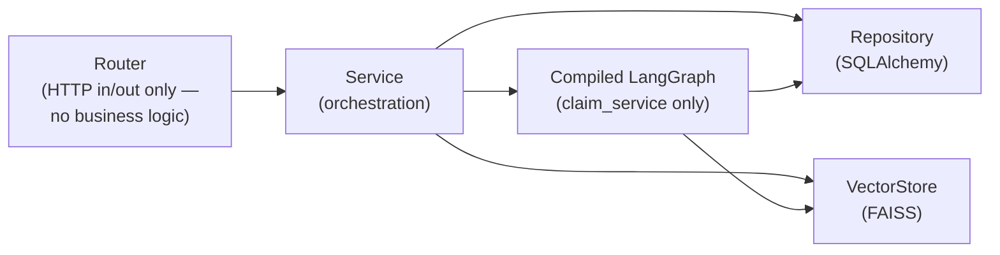
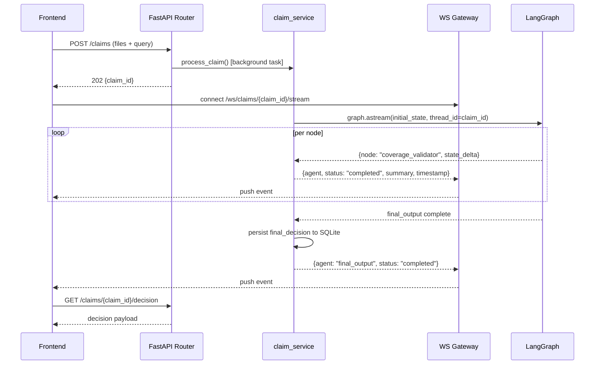

# API Architecture

## 1. Layering

Every arrow is a FastAPI `Depends()` edge, not a direct import — `claims.py` (router) depends on `get_claim_service`, which itself depends on `get_db_session`, `get_compiled_graph`, and `get_vector_store`. This is what "use dependency injection" concretely means here: in tests, `get_compiled_graph` can be overridden with a graph built from a fake LLM, and `get_db_session` with an in-memory SQLite engine, without touching router or service code.

**Why routers never call the graph directly:** a router method must return an HTTP response quickly. Running the full 9-node pipeline synchronously inside a request handler would mean either the client blocks for the full LLM chain (multiple seconds to tens of seconds) or FastAPI's request timeout fires. `claim_service.process_claim()` is invoked as a background task; the router returns `202 Accepted` with a `claim_id` immediately, and the client is expected to open the WebSocket for progress and/or poll `GET /claims/{id}`.

## 2. REST endpoints

| Method & Path | Auth | Purpose | Notes |
|---|---|---|---|
| `GET /health` | none | Liveness | Cheap, dependency-free; for an orchestrator deciding whether to restart the process |
| `GET /health/ready` | none | Readiness | Checks DB connectivity + both vector indices; `503` if any check fails |
| `POST /api/v1/claims` | API key | Submit claim: multipart upload (1+ documents) + `query` + `claimant_id` | Returns `202` with `{claim_id, status: "processing"}` immediately; kicks off graph run as background task |
| `GET /api/v1/claims/{claim_id}` | API key | Poll claim status | `{status: "processing" \| "completed" \| "blocked" \| "failed"}` |
| `GET /api/v1/claims/{claim_id}/decision` | API key | Final decision payload | `404` while `status == "processing"`; populates the Decision Dashboard |
| `POST /api/v1/claims/{claim_id}/dispute` | API key | Post a dispute message | Invokes `dispute_service`, returns the assistant's reply; appends both messages to `audit_log` |
| `POST /api/v1/claims/{claim_id}/dispute/stream` | API key | Same as above, as Server-Sent Events | Token-by-token as the model generates — see section 3b |
| `GET /api/v1/claims/{claim_id}/dispute` | API key | Full dispute thread | Populates the Dispute Flow screen on load/refresh |
| `GET /api/v1/claims/{claim_id}/audit` | API key | Full timestamped audit log | Populates the Audit Trail screen |
| `GET /api/v1/claimants/{claimant_id}/history` | API key | Prior claims + decisions for a claimant | Long-term memory read path — SQL, not vector search (exact identity lookup) |

### Authentication

Every `/api/v1/*` route requires an `X-API-Key` header, checked against `settings.api_keys` (`app/api/auth.py`). This is a single static shared secret, not per-user auth — there is no user model anywhere in this system (a `claimant_id` is an opaque caller-supplied identifier, not an authenticated identity), so the actual boundary this needs to enforce is "is the caller our frontend / an authorized service," which a shared secret is sufficient for. `docs/security-architecture.md` has the fuller reasoning, including the explicit scope note on what this does and doesn't defend against for a browser-embedded key.

Configuration is fail-closed by design: `API_KEYS` has no default value anywhere in the code, and an empty list means every request is rejected — never that auth is silently skipped. `/health` and `/health/ready` are the only unauthenticated routes, since infrastructure probing them shouldn't depend on a distributed key.

`fastapi.security.APIKeyHeader` is used specifically so FastAPI registers it as an OpenAPI security scheme — every protected route gets a lock icon in `/docs`, with a working "Authorize" button.

## 3. WebSocket streaming

`WS /ws/v1/claims/{claim_id}/stream`

The Processing View's "live per-agent status with streaming log" requirement maps directly onto LangGraph's `.astream(..., stream_mode="updates")`, which yields one event per node completion. `services/streaming.py` wraps this generator and forwards each event to any WS clients subscribed to that `claim_id`:

**Why a WS message per node, not a token-level stream of each LLM call:** the spec's requirement is *"live per-agent status,"* not live token generation — streaming raw model tokens for every internal agent call would be noisy for the Processing View's actual purpose (showing pipeline progress) and would leak intermediate, possibly-unredacted reasoning to the client before the Security Checker has run. Node-level events are also what the Audit Trail is built from, so the same event shape serves both the live view and the persisted log — one representation, two consumers.

**Why the WS connection is separate from the POST that starts processing**, rather than doing this over Server-Sent Events on the POST response: the Processing View route (`/processing/[claimId]`) can be reloaded or opened in a second tab and still show live status by reconnecting to the same `claim_id` stream — decoupling submission from viewing matches how the 5 screens are navigated independently (a user can leave Processing and come back).

**WS authentication is a query param** (`?api_key=...`), not the `X-API-Key` header every REST route uses — the browser `WebSocket` API cannot set custom headers on the connect handshake, so the header-based scheme isn't reachable here. An invalid or missing key closes the connection with application code `4401` (the `4000`–`4999` range RFC 6455 reserves for application use) before `accept()`, since a plain WS close frame has no room for an HTTP-style status/body.

## 3b. SSE token streaming (dispute chat)

`POST /api/v1/claims/{claim_id}/dispute/stream` is the same reply as `POST /dispute`, delivered as Server-Sent Events instead of one blocking JSON response — `dispute_service.stream_message()` consumes `chat_model.astream(prompt)` and yields `event: token` frames as they're produced, followed by one `event: done` frame carrying the persisted message id.

This is genuinely different from the claim pipeline's node-level WS stream, and deliberately allowed where that one wasn't (see the "why a WS message per node" note above): dispute streaming runs *after* a decision is already finalized, directly on the claimant's own message, with no unredacted claim-document content anywhere in the prompt. There's no Security Checker gate this could race ahead of.

**Implementation note — validate before streaming starts:** once a `StreamingResponse` sends its first byte, the response's `200` status and headers are already on the wire, so an exception raised mid-generator (e.g. `ClaimNotFoundError` for a bad `claim_id`) can no longer become a proper `404`. The router works around this by calling `__anext__()` on the generator once, *before* constructing the `StreamingResponse` — any validation failure in `_load_context()` (shared with the non-streaming endpoint) surfaces there instead, and flows through the normal exception handlers like every other route.

## 4. Error handling

Domain exceptions (`ClaimNotFoundError`, `AuthenticationError`, `VectorStoreError`, `LLMProviderError`, ...) are raised from the service layer and mapped to HTTP status codes by a `ClaimAgentError` handler registered in `core/exceptions.py` — routers never write `try/except` blocks. Two more handlers cover what isn't a modeled domain error: `RequestValidationError` (bad request shape — FastAPI's own 422) is reshaped into the same JSON envelope instead of its default `{"detail": [...]}` form, and a catch-all `Exception` handler logs the full traceback server-side and returns a generic message with no internal detail, so a genuine bug never leaks a stack trace to a client. All three share one JSON shape (`{error_code, message, claim_id?}` / `{error_code, message, details}` for validation / `{error_code, message, request_id}` for the catch-all) so the frontend has one error-handling path instead of one per endpoint.

`InjectionBlockedError` is deliberately **not** a 4xx/5xx error — a blocked claim is a successful, correctly-handled pipeline outcome (the Security Checker did its job), so it surfaces as `status: "blocked"` in the normal decision payload, not as an HTTP error. Reserving HTTP error codes for actual system failures (bad input, LLM provider down, DB unavailable) keeps the frontend's error-vs-blocked-result branching honest.

**A subtlety with the catch-all handler:** Starlette wires a handler registered for the bare `Exception` class into `ServerErrorMiddleware`, which wraps *outside* every user-added middleware — including `RequestContextMiddleware` (section 5). By the time that handler runs, the request-id contextvar it would normally read has already been reset. The handler instead reads `request.state.request_id`, which `RequestContextMiddleware` also stashes directly on the ASGI `scope` — a plain dict threaded unchanged through every layer regardless of how the exception propagates. See `app/core/middleware.py`'s module docstring for the full mechanics; this is also why that middleware is a raw ASGI class rather than `starlette.middleware.base.BaseHTTPMiddleware` (the latter has its own well-documented incompatibility with exception-handler-produced responses).

## 5. Middleware & structured logging

`RequestContextMiddleware` (`app/core/middleware.py`) is the only custom middleware beyond CORS. For every HTTP request it: reads or generates an `X-Request-ID`, stamps it onto both a contextvar (`app.core.logging.request_id_var`) and `request.state`, logs one `request_completed` (or `request_failed`) line with method/path/status/duration once the response is done, and echoes the id back as a response header.

The contextvar is what makes this a genuine cross-cutting concern rather than a parameter every function down the call stack has to accept and forward: `app.core.logging.RequestIdFilter` is attached to the root logger's handler, so *any* log line emitted anywhere during that request — deep inside a LangGraph node, a repository call, the RAG retriever — automatically carries the same `request_id`, with zero call-site changes anywhere in `agents/`, `services/`, or `memory/`. All logs are structured JSON (`app.core.logging.JsonFormatter`), so this id is directly grep/query-able alongside every other field a call site attaches via `extra={...}`.
