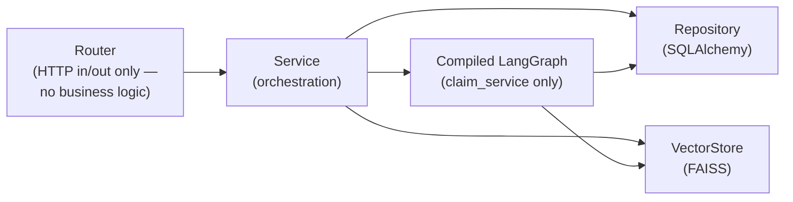
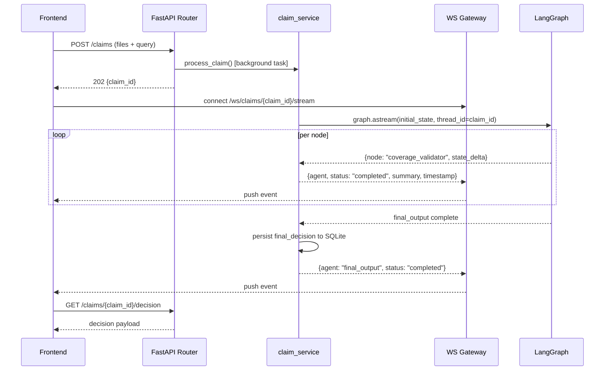

# API Architecture

## 1. Layering

Every arrow is a FastAPI `Depends()` edge, not a direct import — `claims.py` (router) depends on `get_claim_service`, which itself depends on `get_db_session`, `get_compiled_graph`, and `get_vector_store`. This is what "use dependency injection" concretely means here: in tests, `get_compiled_graph` can be overridden with a graph built from a fake LLM, and `get_db_session` with an in-memory SQLite engine, without touching router or service code.

**Why routers never call the graph directly:** a router method must return an HTTP response quickly. Running the full 9-node pipeline synchronously inside a request handler would mean either the client blocks for the full LLM chain (multiple seconds to tens of seconds) or FastAPI's request timeout fires. `claim_service.process_claim()` is invoked as a background task; the router returns `202 Accepted` with a `claim_id` immediately, and the client is expected to open the WebSocket for progress and/or poll `GET /claims/{id}`.

## 2. REST endpoints

| Method & Path | Purpose | Notes |
|---|---|---|
| `POST /api/v1/claims` | Submit claim: multipart upload (1+ documents) + `query` + `claimant_id` | Returns `202` with `{claim_id, status: "processing"}` immediately; kicks off graph run as background task |
| `GET /api/v1/claims/{claim_id}` | Poll claim status | `{status: "processing" \| "completed" \| "blocked" \| "failed"}` |
| `GET /api/v1/claims/{claim_id}/decision` | Final decision payload | `404` while `status == "processing"`; populates the Decision Dashboard |
| `POST /api/v1/claims/{claim_id}/dispute` | Post a dispute message | Invokes `dispute_service`, returns the assistant's reply; appends both messages to `audit_log` |
| `GET /api/v1/claims/{claim_id}/dispute` | Full dispute thread | Populates the Dispute Flow screen on load/refresh |
| `GET /api/v1/claims/{claim_id}/audit` | Full timestamped audit log | Populates the Audit Trail screen |
| `GET /api/v1/claimants/{claimant_id}/history` | Prior claims + decisions for a claimant | Long-term memory read path — SQL, not vector search (exact identity lookup) |

## 3. WebSocket streaming

`WS /ws/v1/claims/{claim_id}/stream`

The Processing View's "live per-agent status with streaming log" requirement maps directly onto LangGraph's `.astream(..., stream_mode="updates")`, which yields one event per node completion. `services/streaming.py` wraps this generator and forwards each event to any WS clients subscribed to that `claim_id`:

**Why a WS message per node, not a token-level stream of each LLM call:** the spec's requirement is *"live per-agent status,"* not live token generation — streaming raw model tokens for every internal agent call would be noisy for the Processing View's actual purpose (showing pipeline progress) and would leak intermediate, possibly-unredacted reasoning to the client before the Security Checker has run. Node-level events are also what the Audit Trail is built from, so the same event shape serves both the live view and the persisted log — one representation, two consumers.

**Why the WS connection is separate from the POST that starts processing**, rather than doing this over Server-Sent Events on the POST response: the Processing View route (`/processing/[claimId]`) can be reloaded or opened in a second tab and still show live status by reconnecting to the same `claim_id` stream — decoupling submission from viewing matches how the 5 screens are navigated independently (a user can leave Processing and come back).

## 4. Error handling

Domain exceptions (`ClaimNotFoundError`, `InjectionBlockedError`, `VectorStoreUnavailableError`, `LLMProviderError`) are raised from the service layer and mapped to HTTP status codes by FastAPI exception handlers registered in `core/exceptions.py` — routers never write `try/except` blocks. All error responses share one JSON shape (`{error_code, message, claim_id?}`) so the frontend has one error-handling path instead of one per endpoint.

`InjectionBlockedError` is deliberately **not** a 4xx/5xx error — a blocked claim is a successful, correctly-handled pipeline outcome (the Security Checker did its job), so it surfaces as `status: "blocked"` in the normal decision payload, not as an HTTP error. Reserving HTTP error codes for actual system failures (bad input, LLM provider down, DB unavailable) keeps the frontend's error-vs-blocked-result branching honest.
