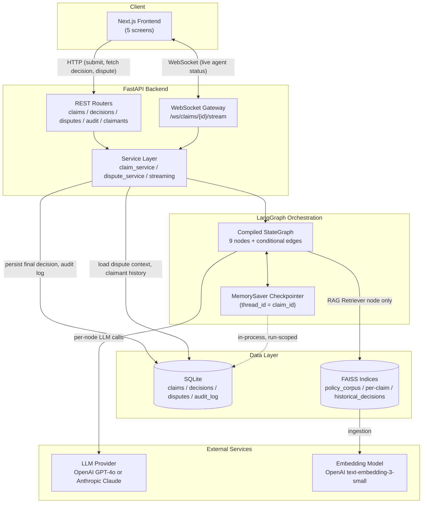

# System Architecture

## 1. Tech stack

| Layer | Choice | Why |
|---|---|---|
| Backend language/runtime | Python 3.11 | Required by spec; structural pattern matching and `TaskGroup` are used in the async orchestration layer |
| Orchestration | LangGraph 0.2+ | Required by spec; gives conditional edges + checkpointing natively, which a hand-rolled agent loop would have to reimplement |
| LLM framework | LangChain 0.3+ | Required by spec; used narrowly — chat model wrappers and structured-output parsing, not LangChain's higher-level chains, to keep control flow explicit in LangGraph rather than hidden in chain abstractions |
| LLM provider | OpenAI GPT-4o or Anthropic Claude, switched by `LLM_PROVIDER` env var | Spec requires configurability; see [design-decisions.md](./design-decisions.md) |
| Embeddings | OpenAI `text-embedding-3-small`, fixed regardless of `LLM_PROVIDER` | Anthropic has no embeddings endpoint; embedding choice is decoupled from chat-model choice — see design-decisions.md |
| Vector store | FAISS (local, on-disk) | See [vector-db-architecture.md](./vector-db-architecture.md) |
| Relational store | SQLite via SQLAlchemy 2.0 Core | See [database-architecture.md](./database-architecture.md) |
| API | FastAPI + native WebSocket support | Required by spec; async-first, Pydantic-native, first-class dependency injection |
| PDF parsing | PyMuPDF (`fitz`) | Better structural/positional extraction than pdfplumber for form-like documents (CMS-1500 field boxes, EOB tables) |
| Frontend | Next.js (App Router) + TypeScript + Tailwind CSS | Required by spec |

## 2. Folder structure

```
.
├── docs/                             # this directory — architecture record
├── backend/
│   ├── pyproject.toml
│   ├── .env.example
│   ├── app/
│   │   ├── main.py                   # FastAPI app factory + lifespan (loads vector stores, DB engine)
│   │   ├── config.py                 # pydantic-settings, single source of env-driven config
│   │   ├── logging_config.py         # structured JSON logging, claim_id correlation
│   │   ├── dependencies.py           # FastAPI DI providers
│   │   ├── api/
│   │   │   ├── routers/
│   │   │   │   ├── claims.py         # POST /claims, GET /claims/{id}
│   │   │   │   ├── decisions.py      # GET /claims/{id}/decision
│   │   │   │   ├── disputes.py       # POST/GET /claims/{id}/dispute
│   │   │   │   ├── audit.py          # GET /claims/{id}/audit
│   │   │   │   └── claimants.py      # GET /claimants/{id}/history
│   │   │   ├── websocket.py          # WS /ws/claims/{id}/stream
│   │   │   └── schemas/              # request/response DTOs (distinct from domain models)
│   │   │       ├── claim.py
│   │   │       ├── decision.py
│   │   │       ├── dispute.py
│   │   │       └── audit.py
│   │   ├── agents/
│   │   │   ├── state.py              # GraphState — the shared state contract, single source of truth
│   │   │   ├── graph.py              # StateGraph assembly: nodes, edges, conditional routing, compile()
│   │   │   ├── routing.py            # conditional-edge functions (route_after_security, route_after_critic)
│   │   │   ├── prompts/              # one prompt module per agent
│   │   │   │   ├── intent_analyzer_prompt.py
│   │   │   │   ├── security_checker_prompt.py
│   │   │   │   ├── coverage_validator_prompt.py
│   │   │   │   ├── fraud_detector_prompt.py
│   │   │   │   ├── answer_synthesizer_prompt.py
│   │   │   │   └── self_critic_prompt.py
│   │   │   └── nodes/                # one file per agent, per spec deliverable requirement
│   │   │       ├── document_preprocessor.py
│   │   │       ├── intent_analyzer.py
│   │   │       ├── rag_retriever.py
│   │   │       ├── security_checker.py
│   │   │       ├── coverage_validator.py
│   │   │       ├── fraud_detector.py
│   │   │       ├── answer_synthesizer.py
│   │   │       ├── self_critic.py
│   │   │       └── final_output.py
│   │   ├── rag/
│   │   │   ├── vector_store.py       # VectorStore protocol + FAISS implementation
│   │   │   ├── embeddings.py         # embedding model factory
│   │   │   ├── chunking.py           # clause-boundary chunker, CPT/ICD-10-aware
│   │   │   ├── ingestion.py          # corpus + historical-decision ingestion pipeline
│   │   │   └── retrieval.py          # multi-source retrieval, merge, threshold flagging
│   │   ├── memory/
│   │   │   ├── checkpointer.py       # LangGraph MemorySaver factory, thread_id strategy
│   │   │   ├── claim_repository.py   # SQLAlchemy repository (claims, decisions, disputes, audit)
│   │   │   └── models.py             # SQLAlchemy table definitions
│   │   ├── security/
│   │   │   ├── injection_detector.py # heuristic layer + LLM classifier layer
│   │   │   ├── pii_redactor.py       # regex + field-label-proximity PII detection/redaction
│   │   │   └── policies.py           # thresholds, blocklist patterns, config
│   │   ├── llm/
│   │   │   └── provider.py           # get_chat_model() factory (OpenAI/Anthropic switch)
│   │   ├── services/
│   │   │   ├── claim_service.py      # orchestrates ingestion → graph invoke → persistence
│   │   │   ├── dispute_service.py    # dispute subgraph invocation
│   │   │   └── streaming.py          # bridges LangGraph .astream() events to WS clients
│   │   └── core/
│   │       ├── exceptions.py         # domain exceptions + FastAPI exception handlers
│   │       └── audit.py              # append_audit() — the one function every node calls to log
│   ├── data/
│   │   ├── policy_corpus/            # source docs, one file per public corpus entry, with citation front-matter
│   │   ├── synthetic_claims/         # generated historical claim decisions (JSON)
│   │   └── indices/                  # persisted FAISS indices — gitignored, rebuilt by script
│   ├── scripts/
│   │   ├── build_policy_index.py
│   │   ├── generate_synthetic_claims.py
│   │   └── init_db.py
│   └── tests/
│       ├── unit/
│       ├── integration/
│       └── security/
│           └── test_prompt_injection.py   # the documented injection-catch proof
├── frontend/
│   ├── package.json
│   ├── app/
│   │   ├── layout.tsx
│   │   ├── submit/page.tsx                # Screen 1: Claim Submission
│   │   ├── processing/[claimId]/page.tsx  # Screen 2: Processing View
│   │   ├── decision/[claimId]/page.tsx    # Screen 3: Decision Dashboard
│   │   ├── dispute/[claimId]/page.tsx     # Screen 4: Dispute Flow
│   │   └── audit/[claimId]/page.tsx       # Screen 5: Audit Trail
│   ├── components/
│   │   ├── ui/                            # shared primitives (Badge, Card, Table)
│   │   ├── claim/UploadForm.tsx
│   │   ├── processing/AgentStatusLog.tsx
│   │   ├── decision/{DecisionBadge,CoverageTable,FraudSignalsPanel,AttorneyFlagBanner,CitationList}.tsx
│   │   ├── dispute/ChatThread.tsx
│   │   └── audit/AuditTimeline.tsx
│   ├── lib/
│   │   ├── api.ts                          # REST client
│   │   ├── websocket.ts                    # WS client hook
│   │   └── types.ts                        # TS types mirroring backend Pydantic schemas
│   └── hooks/useClaimStream.ts
└── test_scenarios/
    ├── 01_full_approval/
    ├── 02_partial_approval/
    ├── 03_denial/
    ├── 04_fraud_detected/
    └── 05_prompt_injection_attack/
```

**Design rationale for this shape:**
- **One node = one file** (`agents/nodes/*.py`) is an explicit deliverable requirement ("each node in its own file with its own system prompt"). Prompts are further split into `agents/prompts/` rather than inlined in the node file, so a prompt can be iterated on/tested independently of the node's control-flow code, and so the node file stays focused on state transitions.
- **`services/` sits between API routers and everything else.** Routers never call agents, the DB, or the vector store directly — this is the dependency-injection seam: routers depend on service interfaces, services depend on repositories/graph/vector-store, and every one of those dependencies is swappable in tests via FastAPI's `Depends()` override mechanism.
- **`schemas/` (API DTOs) are separate from `agents/state.py` (internal graph state) and `memory/models.py` (DB tables).** These are three different concerns that happen to look similar — collapsing them into one model would leak internal LangGraph state shape into the public API contract, and leak DB column constraints into agent logic. Each layer changes for a different reason, so each gets its own type.
- **`data/indices/` is gitignored** — FAISS index files are build artifacts, not source. `scripts/build_policy_index.py` regenerates them deterministically from `data/policy_corpus/`, so nothing of value is lost by excluding them from version control, and the repo doesn't carry binary blobs.

## 3. Component diagram



**Why the Service Layer mediates between the API and the Graph** (rather than routers invoking the graph directly): claim submission needs to (1) validate/store uploaded files, (2) kick off graph execution as a background task so the HTTP response returns immediately with a `claim_id`, (3) stream progress over a *separate* WebSocket connection, and (4) persist the final state once the graph finishes. That's four concerns no single router handler should own. `claim_service.process_claim()` owns this orchestration; the router's job is only translating HTTP in and out.

**Why the checkpointer is drawn as "in-process, run-scoped" rather than part of the persistent Data Layer:** this is a deliberate seam explained fully in [memory-architecture.md](./memory-architecture.md) — LangGraph's `MemorySaver` is the *short-term* mechanism (survives across nodes within one run), while SQLite is the *long-term* mechanism (survives across process restarts and sessions). Conflating them would mean either bloating SQLite with per-node intermediate state it doesn't need, or losing dispute history when the process restarts.
