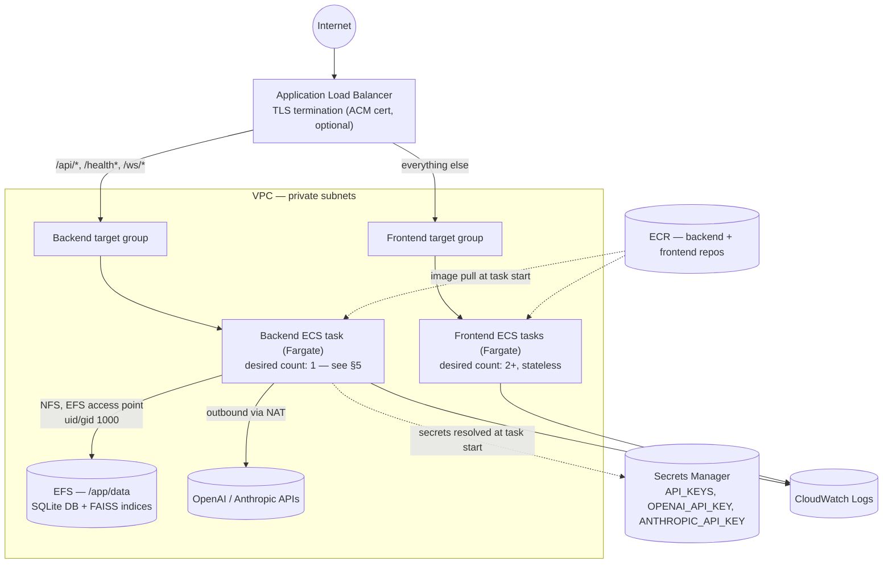

# AWS Deployment

Concrete reference architecture for running this system on AWS, plus the CloudFormation template
that provisions it (`infra/aws/ecs-stack.yaml`) and the CD workflow that deploys to it
(`.github/workflows/deploy.yml`). Read [`docs/deployment.md`](./deployment.md) first — this doc is
the AWS-specific instantiation of the principles it lays out (secrets, persistent storage, the
single-writer constraint, TLS termination, CI/CD).

## 1. Why ECS Fargate

| Option | Rejected because |
|---|---|
| EC2 (self-managed) | Patching/scaling the underlying instances is undifferentiated ops work this project has no reason to take on — Fargate removes it entirely. |
| App Runner | No first-class support for mounting a shared persistent filesystem (EFS) at a fixed container path, which §4 (persistent storage) requires for the backend. |
| Lambda | The pipeline is a long-running, multi-agent LangGraph run (multi-second-to-tens-of-seconds per the existing `docs/api-architecture.md` decision to run it as a background task, not inline with the HTTP request) plus a WebSocket stream for live status — a poor fit for Lambda's request/response and execution-time-limit model. |
| Kubernetes (EKS) | A control plane and node-group operational surface with no benefit over ECS for a two-service application at this scale. |

**ECS Fargate** is chosen: no servers to patch, native ALB integration, native EFS volume support,
and a task definition that maps directly onto each Dockerfile's `ENV`/`ARG`/`EXPOSE`/`HEALTHCHECK`
already reviewed in `docs/deployment.md` §1.

## 2. Architecture



Everything in `infra/aws/ecs-stack.yaml` in one pass: a dedicated VPC (2 public + 2 private
subnets across 2 AZs, one NAT gateway), an ECS cluster, two ECR repositories, two task
definitions/services, an EFS file system + access point, an ALB with path-based routing, three
placeholder Secrets Manager entries, and the IAM roles/security groups/log groups all of that
needs. Every resource and the reasoning behind it is commented in the template itself — this doc
covers the decisions worth explaining at a level above individual `Resources:` blocks.

## 3. Path-based routing

One ALB serves both services, routed by path — mirroring `backend/app/main.py`'s router prefixes:

| Path pattern | Target |
|---|---|
| `/api/*`, `/health`, `/health/*`, `/ws/*` | Backend target group (container port 8000) |
| everything else | Frontend target group (container port 3000) — the default action |

One ALB instead of two is a deliberate simplification: one DNS name, one TLS certificate, one
place CORS has to line up (`CORS_ORIGINS` on the backend must match this ALB's origin — see
`docs/deployment.md` §5). The backend target group sets a 60-second deregistration delay
specifically so a task being drained during a deploy doesn't cut off an in-flight
`/ws/v1/claims/{id}/stream` WebSocket connection mid-claim.

## 4. Persistent storage: EFS

The stack provisions one EFS file system with a single access point (POSIX uid/gid `1000`,
matching the `appuser` created in `docker/backend.Dockerfile`), mounted into the backend task
definition at `/app/data` — the same path `docker-compose.yml`'s `backend_data` named volume uses
locally. This is the AWS instantiation of the persistent-storage requirement in
`docs/deployment.md` §3: the SQLite database and FAISS indices must outlive any single task.

EFS (not EBS) specifically because EBS volumes attach to a single AZ and a single task at a time,
which would either pin the backend task to one AZ or require re-attaching on every task
replacement; EFS mount targets exist in both private subnets and NFS-mount cleanly regardless of
which AZ the current backend task lands in.

**Back this up.** AWS Backup (or a scheduled EFS-to-EFS/S3 backup) covering this file system is
the only recovery path if it's ever lost — see `docs/deployment.md` §3 for why this isn't
optional.

## 5. The single-writer constraint, on ECS specifically

`BackendDesiredCount` is a template parameter fixed to `AllowedValues: [1]` — the template will
reject a stack update that tries to set it higher. This isn't a missing feature; it's
`docs/design-decisions.md` decision #3 (SQLite, single-writer) enforced at the infrastructure
layer instead of only in prose. The backend `AWS::ECS::Service` also sets
`DeploymentConfiguration: { MinimumHealthyPercent: 0, MaximumPercent: 100 }` — a deploy stops the
old task before starting the new one (a few seconds of backend unavailability), rather than ECS's
usual default of running old-and-new simultaneously, which here would mean two tasks writing the
same SQLite file on EFS at once. The frontend service has no such restriction
(`MinimumHealthyPercent: 100, MaximumPercent: 200` — standard rolling deploy) because it's
stateless.

If claim volume ever outgrows a single backend task, the fix is migrating `DATABASE_URL` to a
networked database (e.g., RDS Postgres) — a real architecture change, not a parameter flip, and
intentionally out of scope for this stack.

## 6. Secrets

`infra/aws/ecs-stack.yaml` creates three `AWS::SecretsManager::Secret` resources
(`<ProjectName>/API_KEYS`, `<ProjectName>/OPENAI_API_KEY`, `<ProjectName>/ANTHROPIC_API_KEY`) with
placeholder string values — CloudFormation templates and their event history are not a safe place
for real secret material, so the template cannot create them pre-populated. The backend task
definition references all three under `Secrets:` (resolved from Secrets Manager by ECS at task
start, injected as environment variables inside the container — never visible in the task
definition itself or in `DescribeTasks` output). Populate the real values once, after the stack's
first creation (see §8, step 4).

The frontend has no runtime secrets to resolve — `NEXT_PUBLIC_API_KEY` is compiled into the image
at build time by the CD pipeline (§7), sourced from GitHub Actions secrets, not from anything in
this stack.

## 7. CD pipeline (`.github/workflows/deploy.yml`)

Runs on push to `main` (after `ci.yml` passes) or manually via `workflow_dispatch`:

1. Authenticate to AWS via **GitHub OIDC** — the workflow assumes an IAM role
   (`GitHubActionsDeployRole`, created once outside this stack per the bootstrap steps in §8) using
   a short-lived token GitHub issues per run. No long-lived AWS access key/secret pair is stored as
   a repository secret.
2. Log in to ECR; build and push the backend image (`docker/backend.Dockerfile`, tagged with the
   commit SHA and `latest`).
3. Build and push the frontend image, passing `NEXT_PUBLIC_API_BASE_URL`, `NEXT_PUBLIC_WS_BASE_URL`,
   and `NEXT_PUBLIC_API_KEY` as build args from GitHub Actions repository variables/secrets — this
   is the one point in the whole pipeline where those build-time-only values (see
   `docs/environment-variables.md`) get supplied for the AWS environment specifically.
4. Update the `BackendService` and `FrontendService` ECS services to the new image tag
   (`aws ecs update-service --force-new-deployment` after registering a new task definition
   revision with the updated `Image`).
5. Wait for both services to reach steady state; fail the workflow if they don't, so a broken
   deploy surfaces in GitHub Actions rather than as a silent production outage.

**Rollback:** re-run the workflow via `workflow_dispatch` against a previous commit, or register a
task definition revision pointing at a previously-pushed image tag and force a new deployment
directly with the AWS CLI — both are covered in `docs/deployment.md` §6.

### Required GitHub configuration

| Name | Kind | Value |
|---|---|---|
| `AWS_DEPLOY_ROLE_ARN` | repository variable | ARN of `GitHubActionsDeployRole` from §8 step 3 |
| `AWS_REGION` | repository variable | e.g. `us-east-1` |
| `ECS_CLUSTER` | repository variable | `ecs-stack.yaml` Output `ClusterName` |
| `ECR_BACKEND_REPOSITORY` | repository variable | `ecs-stack.yaml` Output `BackendRepositoryUri` |
| `ECR_FRONTEND_REPOSITORY` | repository variable | `ecs-stack.yaml` Output `FrontendRepositoryUri` |
| `ECS_BACKEND_SERVICE` / `ECS_FRONTEND_SERVICE` | repository variable | `ecs-stack.yaml` Outputs `BackendServiceName` / `FrontendServiceName` |
| `ECS_BACKEND_TASK_FAMILY` / `ECS_FRONTEND_TASK_FAMILY` | repository variable | `ecs-stack.yaml` Outputs `BackendTaskDefinitionFamily` / `FrontendTaskDefinitionFamily` |
| `NEXT_PUBLIC_API_BASE_URL` / `NEXT_PUBLIC_WS_BASE_URL` | repository variable | `https://`/`wss://` + the ALB DNS name or custom domain |
| `NEXT_PUBLIC_API_KEY` | **repository secret** | one of the values in the `API_KEYS` Secrets Manager entry (§8 step 4) |

## 8. Bootstrap order (first deployment only)

CloudFormation can't build a Docker image, and the task definitions require an image to already
exist in ECR — so the very first deployment has an unavoidable chicken-and-egg step. After this,
every subsequent deploy is just the CD pipeline (§7).

1. **Create the GitHub OIDC provider and deploy role**, once, outside this stack (either by hand
   or a small separate CloudFormation template — kept out of `ecs-stack.yaml` because it's
   account-level and org-specific, not part of this application's own infrastructure):
   an `AWS::IAM::OIDCProvider` for `token.actions.githubusercontent.com`, and an
   `AWS::IAM::Role` (`GitHubActionsDeployRole`) trusting it, scoped via the trust policy's
   `token.actions.githubusercontent.com:sub` condition to this repository, with permissions to
   push to ECR, update the two ECS services, and register task definitions.
2. **First stack creation**, pointing `BackendImage`/`FrontendImage` at *any* placeholder tag —
   they don't need to resolve yet:
   ```bash
   aws cloudformation deploy \
     --template-file infra/aws/ecs-stack.yaml \
     --stack-name claims-agent \
     --capabilities CAPABILITY_IAM \
     --parameter-overrides BackendImage=placeholder FrontendImage=placeholder
   ```
   The `BackendService`/`FrontendService` tasks will fail to start (no such image) until step 3 —
   expected at this point, not a stack failure; the stack itself will still reach `CREATE_COMPLETE`
   since the ECS service resources only require the task definition to be valid, not the image to
   be pullable.
3. **Build and push real images once by hand** (or trigger `deploy.yml` manually), then update the
   stack with the real image URIs:
   ```bash
   aws cloudformation deploy --template-file infra/aws/ecs-stack.yaml --stack-name claims-agent \
     --capabilities CAPABILITY_IAM \
     --parameter-overrides BackendImage=<ecr-uri>:<tag> FrontendImage=<ecr-uri>:<tag>
   ```
4. **Populate the real secrets** (the stack only creates placeholders — see §6):
   ```bash
   aws secretsmanager put-secret-value --secret-id claims-agent/API_KEYS \
     --secret-string '["<a generated value>"]'
   aws secretsmanager put-secret-value --secret-id claims-agent/OPENAI_API_KEY --secret-string '<key>'
   aws secretsmanager put-secret-value --secret-id claims-agent/ANTHROPIC_API_KEY --secret-string '<key>'
   ```
   Then force a new deployment of `BackendService` so the running task picks up the real values
   (ECS resolves `Secrets:` at task start, not continuously).
5. **Fill in the GitHub configuration table in §7** using this stack's Outputs
   (`aws cloudformation describe-stacks --stack-name claims-agent --query Stacks[0].Outputs`), and
   set `NEXT_PUBLIC_API_KEY` to the same value used in step 4.
6. From here on, every push to `main` deploys through `deploy.yml` — no more manual AWS CLI steps.

## 9. Custom domain and TLS

The stack works out of the box over plain HTTP on the ALB's generated DNS name (`CertificateArn`
defaults to empty — see the `HasCertificate` condition in the template). To add a real domain:
request or import a certificate in ACM for that domain, pass its ARN as `CertificateArn` on the
next stack update (this adds the HTTPS listener and an HTTP→HTTPS redirect on port 80 — see the
template's `HttpListener`/`HttpsListener` resources), point a Route 53 (or other DNS) alias/CNAME
at the ALB's DNS name, and update `CORS_ORIGINS` (backend) and `NEXT_PUBLIC_API_BASE_URL` /
`NEXT_PUBLIC_WS_BASE_URL` (frontend, §7 table — `wss://` once TLS is live, per
`docs/deployment.md` §5) to the real domain.

## 10. Cost shape (informational, not a bill)

Roughly: one NAT gateway (hourly + per-GB), one ALB (hourly + per-LCU), one EFS file system
(per-GB-month, bursting throughput — cheap at this system's expected data volume), one Fargate
task for the backend and 2+ for the frontend (vCPU/memory-hour), ECR storage (per-GB-month, capped
by the 20-image lifecycle policy in the template), and CloudWatch Logs ingestion/storage
(bounded by `LogRetentionDays`, default 30). The single NAT gateway and single-AZ EFS mount targets
already lean toward "cheapest reasonable first deployment" over "maximum redundancy" — see the
comment on the `NatGateway` resource in the template for the specific tradeoff.
