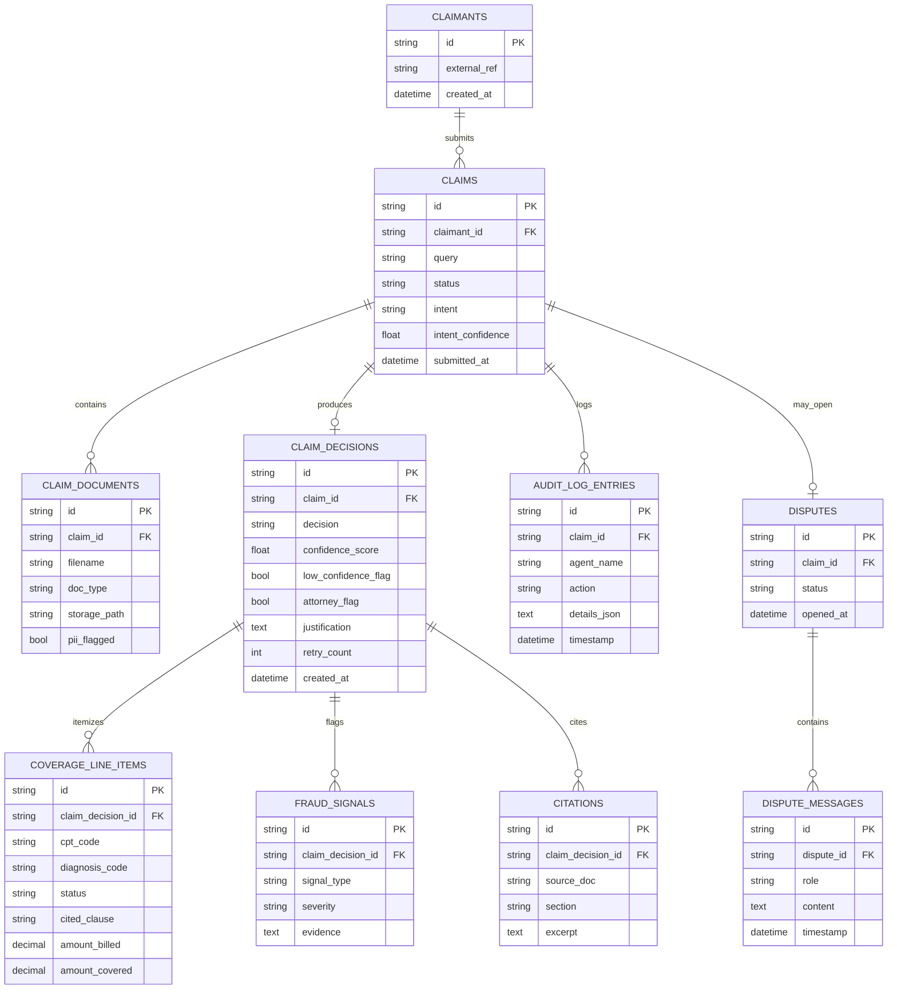

# Database Architecture

## 1. Why SQLite + SQLAlchemy 2.0 Core (not a full ORM, not Postgres)

- **SQLite, not Postgres/MySQL:** this system has one writer process (the FastAPI backend), no multi-service concurrent-write contention, and needs zero external infrastructure to run or to hand to an interviewer. SQLite's single-file durability and zero-ops nature matches that exactly. The repository layer (`memory/claim_repository.py`) is the only place that knows the DB is SQLite — if this needed to become Postgres for real concurrent load, that's a connection-string and dialect change behind an unchanged interface, not a rewrite.
- **SQLAlchemy Core, not the ORM layer:** the schema here is simple (8 tables, no deep object graphs, no lazy-loading traversal needed) and every query is either a single-table insert or a straightforward join. Full ORM (declarative models, relationship() lazy loading, unit-of-work sessions) buys machinery this project doesn't need and makes it easier to accidentally issue N+1 queries through lazy relationships. Core gives typed, parameterized, explicit queries — every query's cost is visible at the call site — while still getting connection pooling and FastAPI-friendly session management. This is the deliberate middle ground between raw `sqlite3` (no type safety, hand-written SQL strings) and full ORM (more abstraction than the schema's complexity justifies).
- **Not the LangGraph checkpointer's storage.** This is intentional and explained fully in [memory-architecture.md](./memory-architecture.md) — this database is for durable, queryable business records (decisions, disputes, audit trail); the checkpointer is for run-scoped agent state. They have different lifetimes and different consumers (this DB is read by the API/frontend; the checkpointer is read only by LangGraph itself).

## 2. Entity-relationship diagram

## 3. Design notes per table

- **`CLAIM_DOCUMENTS.storage_path` points to disk, not a DB blob column.** Uploaded PDFs are written to a content-addressed path on disk (or object storage in a real deployment) and only the path is persisted relationally — keeps the SQLite file small and lets the storage backend be swapped (local disk → S3) without a schema change.
- **`COVERAGE_LINE_ITEMS.cited_clause` is `NOT NULL`-equivalent at the application layer** (enforced in Coverage Validator's structured-output schema, not just the DB) — this is where the acceptance criterion *"every claim decision cites a specific clause or statute"* and *"no unsupported denials"* is actually enforced. The DB column existing is necessary but not sufficient; the Pydantic model that the LLM's structured output is parsed into requires this field, so a response missing it fails validation before it's ever written.
- **`AUDIT_LOG_ENTRIES` is append-only** — no `UPDATE` statement exists against this table anywhere in the codebase, only `INSERT`. This is what makes it a credible audit trail rather than a mutable status field; if a later agent needs to record something, it adds a new row, it never edits a prior agent's row. This is the DB-level enforcement of the state-ownership rule from [agent-architecture.md](./agent-architecture.md) extended to persistence.
- **`FRAUD_SIGNALS` and `COVERAGE_LINE_ITEMS` are 1-to-many off `CLAIM_DECISIONS`, not columns on it** — a claim can have zero to many fraud signals (spec requires all 4 signal types to be *scored*, not all to necessarily fire) and one row per line-item is required to satisfy *"partial approval must itemize which line-items are approved vs. denied."* Cramming these into JSON columns on `CLAIM_DECISIONS` would make the Decision Dashboard's coverage table and fraud panel harder to query and would prevent per-line-item indexing if the corpus of claims grows.
- **`DISPUTES` is 1-to-1(-or-none) with `CLAIMS`** in this design (one dispute thread per claim, not per line-item) — the spec's Dispute Flow is "multi-turn chat to contest a decision" as a whole, not per-line-item negotiation. `DISPUTE_MESSAGES` is where the actual multi-turn history lives, keyed by `dispute_id`.
