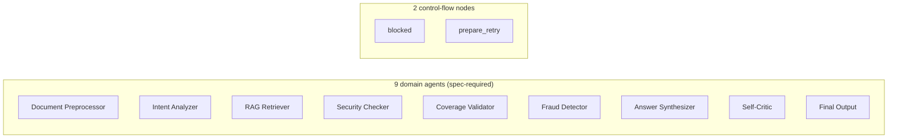
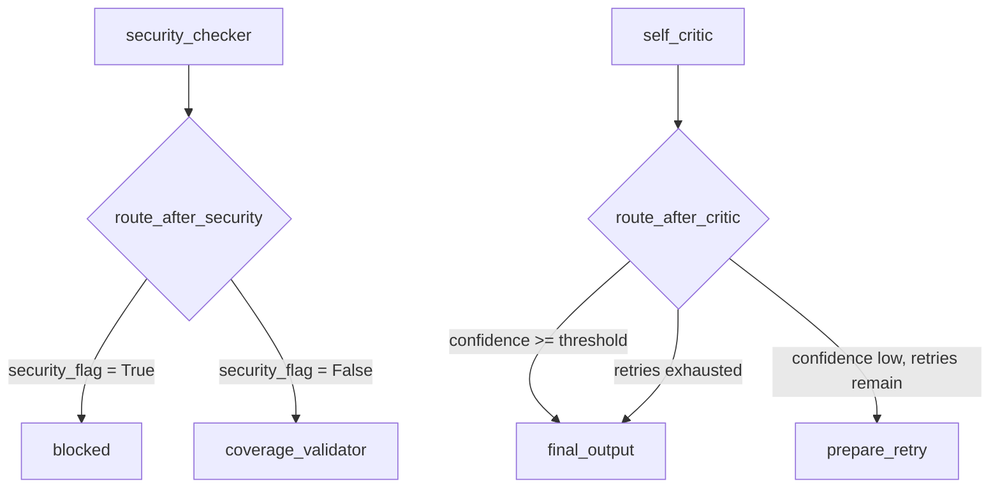
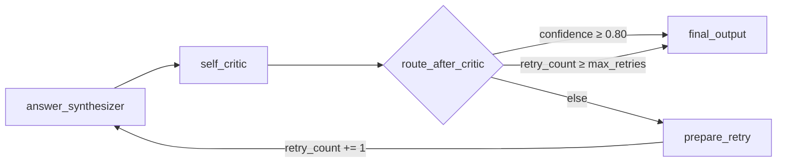
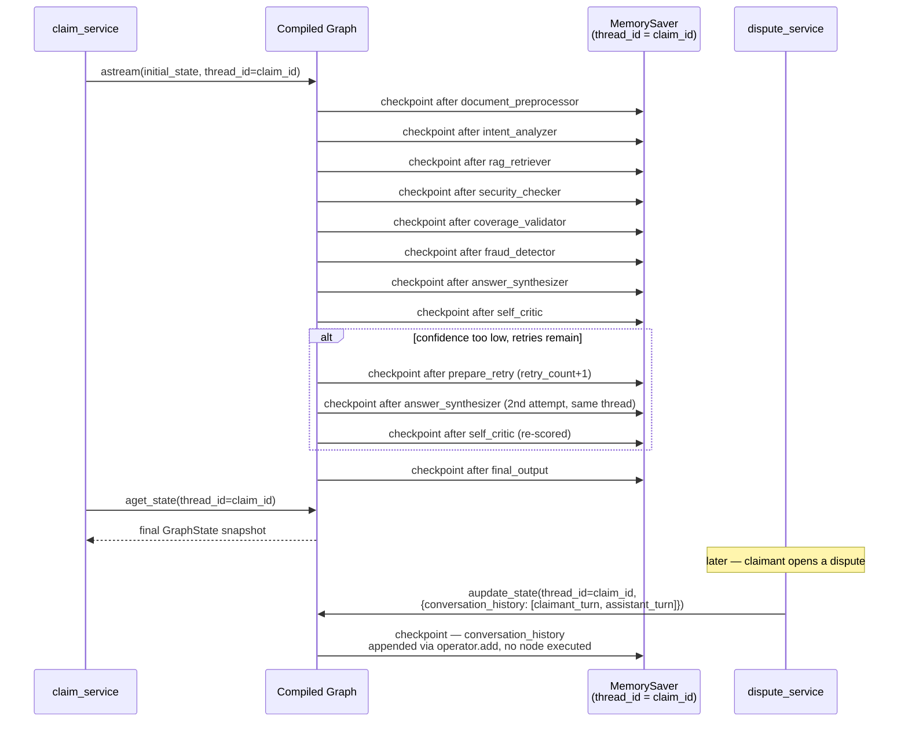
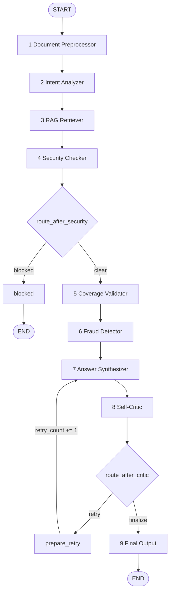

# LangGraph Design

This is the complete design of the claim-processing `StateGraph`: state schema, every node,
every edge, both conditional routers, the retry loop, and the memory/checkpointing/audit-log
mechanics that make the graph safe to retry and inspect after the fact.

This document describes the graph as it is actually wired in `backend/app/agents/graph.py`,
`backend/app/agents/routing.py`, `backend/app/state/graph_state.py`, `backend/app/core/audit.py`,
`backend/app/memory/checkpointer.py`, and `backend/app/services/dispute_service.py` — those files
already exist and pass 36 tests. The state schema uses the field names requested for shared-state
implementation (`claim_document`, `chunks`, `coverage`, `citations`, `confidence`, `security_flag`,
`self_critique`, `decision`, plus the new `fraud_score`, `pii_detected`, `conversation_history`
fields) rather than the earlier internal names (`document_chunks`, `coverage_map`, `critic_score`,
etc.) used in the first implementation pass — the rename was cascaded through every consumer, not
left half-applied.

## 1. State

### Why `GraphState` is a `TypedDict`, not a Pydantic model

LangGraph's `StateGraph` accepts any schema it can merge dict-shaped updates into — `TypedDict`,
a dataclass, or a Pydantic model all work. `GraphState` is a `TypedDict` with `total=False`
(every field optional/absent until some node writes it) because:

- **It's cheap.** A node returns a small dict of *only the fields it's changing* — no
  construction or validation cost for the ~25 fields it isn't touching, on every one of the 9+
  hops through the graph.
- **Validation already happens at the right layer.** Each node that calls an LLM parses the
  response through its own Pydantic model (e.g. `IntentClassification`, `_CoverageValidationResult`)
  *before* it ever touches `GraphState`. Re-validating a second time at the state layer would be
  redundant — `GraphState` is the contract for what flows *between* nodes, not a second
  validation boundary.
- **`total=False` encodes the graph's own shape.** A field like `coverage` genuinely doesn't
  exist until Coverage Validator (node 5) has run — modeling that as `Optional[...]` on every
  field of a "complete" Pydantic object would be less honest than a dict that simply doesn't have
  the key yet.

Every nested value (a chunk, a coverage line-item, a fraud signal, an audit entry, a conversation
turn) is itself a fully-typed `TypedDict`, not a bare `dict`. Nothing in the schema is `Any`.

### Field ownership

Every field is written by exactly one node (see the [Nodes](#2-nodes) section for detail on
each). This is what the spec's *"no agent re-fetches data that a previous agent already
produced"* and *"each agent writes only its own output fields"* requirements come down to as a
concrete rule: a node's return value only ever contains keys from its own row below.

| Field(s) | Type | Owner |
|---|---|---|
| `claim_id`, `claimant_id`, `query` | `str` | input (set once, before the graph runs) |
| `claim_document` | `list[RawDocument]` | input — the uploaded file(s) for this claim |
| `chunks`, `document_metadata` | `list[DocumentChunk]`, `dict` | Document Preprocessor |
| `pii_detected` | `bool` | Document Preprocessor |
| `intent`, `intent_confidence`, `extracted_entities` | `Intent`, `float`, `dict` | Intent Analyzer |
| `retrieved_chunks`, `low_confidence_retrieval` | `list[RetrievedChunk]`, `bool` | RAG Retriever |
| `security_flag`, `redacted_chunks` | `bool`, `list[RetrievedChunk]` | Security Checker |
| `coverage`, `citations` | `list[CoverageLineItem]`, `list[Citation]` | Coverage Validator |
| `fraud_signals`, `fraud_score`, `attorney_flag` | `list[FraudSignal]`, `float`, `bool` | Fraud Detector |
| `decision`, `justification`, `disclaimer` | `Decision`, `str`, `str` | Answer Synthesizer |
| `confidence`, `self_critique`, `retry_count` *(read)*, `low_confidence` | `float`, `str`, `int`, `bool` | Self-Critic |
| `retry_count` *(write)* | `int` | `prepare_retry` (control-flow node — see [Retry Loop](#5-retry-loop)) |
| `final_decision` | `FinalDecision` | Final Output |
| `audit_log` | `list[AuditLogEntry]` | every node (accumulating — see [Audit Log](#8-audit-log)) |
| `conversation_history` | `list[ConversationTurn]` | dispute flow, via `aupdate_state` (accumulating — see [Shared State](#9-shared-state)) |

**Fields deliberately kept out of `GraphState`.** Two detection functions return richer,
per-item detail than any downstream node actually consumes:

- `flag_pii()` (`app.security.pii_redactor`) returns a `list[PIIFlag]` — which chunk, which PII
  type, which field label matched. No node branches on *which* chunk had PII, only on *whether
  any* did, so Document Preprocessor reduces this to `pii_detected: bool` for state and writes
  the full list into its own audit_log entry's `details` instead.
- `InjectionDetector.detect()` (`app.security.injection_detector`) returns a `SecurityFlags`
  dict — heuristic matches, LLM confidence, LLM reasoning. `route_after_security` only ever
  needs the boolean, so Security Checker reduces this to `security_flag: bool` for state and
  writes the full dict into its audit_log entry's `details`.

Both types are defined in their owning module now, not in `state/graph_state.py` — a type only
lives in the shared-state module if it's actually a `GraphState` field's value type.

### The two accumulating fields: `audit_log` and `conversation_history`

```python
audit_log: Annotated[list[AuditLogEntry], operator.add]
conversation_history: Annotated[list[ConversationTurn], operator.add]
```

Every other field is a plain overwrite-on-write (whatever a node returns for a field replaces
the previous value — safe here only because each field has exactly one writer). These two are
different: they must accumulate across multiple writes, so they're declared with LangGraph's
`Annotated[type, reducer]` pattern. When something returns `{"audit_log": [entry]}`, LangGraph
doesn't overwrite the list — it calls `operator.add(existing_list, [entry])`, i.e. concatenates.
`conversation_history` uses the identical mechanism but is written differently: no domain node
ever touches it during the main run (it starts as `[]`, seeded in `claim_service.py`'s initial
state) — it's appended to later, by the dispute flow, via `graph.aupdate_state()` against the
claim's already-existing checkpointed thread. See [Shared State](#9-shared-state) and
[Checkpointing](#7-checkpointing) for why that's the correct mechanism rather than a third
domain node.

## 2. Nodes

11 nodes are registered on the graph: the **9 domain agents** the spec requires, plus **2
control-flow nodes** (`blocked`, `prepare_retry`) that exist only to make the conditional routing
and retry loop structurally sound — they contain no claim-processing logic.



### 1 — Document Preprocessor
**LLM-free, deterministic.** Parses `claim_document` (uploaded PDFs, via PyMuPDF), chunks by
clause/section boundary — never a fixed token window, since that's the spec's named failure mode
— preserving CPT/ICD-10 codes and policy section numbers verbatim via regex extraction. Flags
SSN/DOB/EIN candidates via regex + field-label proximity *before any LLM call exists anywhere in
the run*. Writes `chunks`, `document_metadata`, `pii_detected`.

### 2 — Intent Analyzer
**LLM, structured output.** Classifies the claimant's query into one of
`coverage_check | denial_appeal | fraud_check | obligation_lookup` and extracts entities
(claimant ID, date of service, procedure/diagnosis codes) via a Pydantic-constrained response —
never free text the graph would have to re-parse. Emits `intent_confidence` rather than silently
guessing on an ambiguous query. Writes `intent`, `intent_confidence`, `extracted_entities`.

### 3 — RAG Retriever
**Vector search, no LLM.** Queries three FAISS collections — an ephemeral per-claim index built
from `chunks`, the persistent `policy_corpus` index, and the persistent `historical_decisions`
index — and merges results with source metadata attached to every chunk. Results below the
configurable similarity threshold are kept and flagged (`low_confidence: true`), not silently
dropped. Writes `retrieved_chunks`, `low_confidence_retrieval`.

### 4 — Security Checker
**Hybrid: regex/heuristic layer + LLM classifier layer.** Runs both detection layers against
`chunks`' raw text; either flagging above its confidence threshold sets `security_flag = true`.
Also produces `redacted_chunks` (PII masked out of `retrieved_chunks`) for every downstream node
to consume instead of the raw chunks. This node only *sets a flag* — the actual hard stop is
enforced by the conditional edge described in [Conditional Routing](#4-conditional-routing).
Writes `security_flag`, `redacted_chunks` (and the full hybrid-detection detail into its own
audit_log entry — see [State](#1-state)).

### 5 — Coverage Validator
**LLM, structured output.** Maps every claim line-item (CPT + diagnosis) to policy coverage using
only `redacted_chunks` as evidence. Every line-item's Pydantic schema requires a non-empty
`cited_clause` — a response missing one fails validation before it ever reaches `GraphState`,
which is the concrete mechanism behind *"every claim decision cites a specific clause."* Writes
`coverage`, `citations`.

### 6 — Fraud Detector
**LLM, structured output.** Scores the claim against all four required signal types (duplicate
billing, upcoding, date conflict, unbundling) using `coverage` and `chunks`. Each reported signal
carries `severity` and an `evidence` string. `fraud_score` is a plain-Python aggregate — the
highest severity present mapped to a number (`low→0.3, medium→0.6, high→0.9`, `0.0` with no
signals), computed by the pure function `compute_fraud_score()` so the aggregation rule is
unit-testable without an LLM call. `attorney_flag` is likewise computed by plain Python
(`any(signal.severity == "high" ...)`), not requested from the model. Writes `fraud_signals`,
`fraud_score`, `attorney_flag`.

### 7 — Answer Synthesizer
**LLM, structured output.** Produces `decision` (`approved | partial_approved | denied`) and
`justification`, grounded only in `redacted_chunks`. On a retry, its prompt includes the prior
`self_critique` as a mandatory section (not optional context) — see [Retry Loop](#5-retry-loop).
The legal disclaimer is appended by plain code immediately after the LLM call returns, never
requested from the model. Writes `decision`, `justification`, `disclaimer`.

### 8 — Self-Critic
**LLM, structured output — adversarial, not self-reflective.** A separate prompt scores the
*draft* (not the same call that produced it) on legal accuracy (40%), completeness (30%), and
hallucination risk (30%), producing `confidence` and, if the score is low, a specific
`self_critique`. It also computes `low_confidence` itself — `True` only when the score is below
threshold *and* `retry_count` has already hit the cap — because this node is the only one with
both numbers in scope at once; the routing function that runs immediately after it only picks
the next node, it can't write state (see [Conditional Routing](#4-conditional-routing)). Writes
`confidence`, `self_critique`, `low_confidence`.

### 9 — Final Output
**LLM-free, deterministic assembly.** Reads the accumulated state (`decision`, `confidence`,
`coverage`, `fraud_signals`, `citations`, ...) and assembles the single `final_decision` object
the API and frontend consume — no new reasoning happens here, it's a pure read of what nodes 1–8
already produced. Writes `final_decision`.

### `blocked` (control-flow)
Terminal node reached only when Security Checker confirms an injection (`security_flag = true`).
Assembles a `final_decision` with `status: "blocked"`. It does not re-derive or restate the
detection detail — Security Checker's own audit_log entry (`action="blocked_injection"`) already
recorded heuristic matches and LLM reasoning; this node's entry only needs to record that the
pipeline halted as a result. No downstream domain agent (5 through 9) ever executes for a blocked
claim — enforced structurally by the graph topology, not by a flag agents are expected to check.

### `prepare_retry` (control-flow)
```python
async def increment_retry_count(state: GraphState) -> dict:
    return {"retry_count": state.get("retry_count", 0) + 1}
```
The single place `retry_count` is incremented. It contains no claim-processing logic and
deliberately does **not** write an audit entry — the retry is already fully captured in
Self-Critic's own audit entry (which includes `retry_count` in its `details`), so a second entry
here would be a redundant restatement of the same fact, not new information.

## 3. Edges

Unconditional edges — always taken, no branching:

```
START → document_preprocessor → intent_analyzer → rag_retriever → security_checker
coverage_validator → fraud_detector → answer_synthesizer → self_critic
blocked → END
final_output → END
prepare_retry → answer_synthesizer
```

The two conditional edges (`security_checker → {…}` and `self_critic → {…}`) are covered next.

## 4. Conditional Routing

Both routers are **pure functions**: `(state) -> str`, no LLM call, no state mutation. That's a
LangGraph API constraint, not a stylistic choice — `add_conditional_edges`'s path function can
only return the name of the next node. Both routers read a decision that an upstream *node*
already computed; routing itself never decides anything new.

```python
def route_after_security(state: GraphState) -> Literal["coverage_validator", "blocked"]:
    return "blocked" if state.get("security_flag") else "coverage_validator"

def route_after_critic(
    state: GraphState, score_threshold: float, max_retries: int
) -> Literal["prepare_retry", "final_output"]:
    if state.get("confidence", 0.0) >= score_threshold:
        return "final_output"
    if state.get("retry_count", 0) >= max_retries:
        return "final_output"
    return "prepare_retry"
```

`route_after_critic` needs two config values (`score_threshold`, `max_retries`) that aren't part
of `GraphState` — they're bound in with `functools.partial` when the edge is registered in
`graph.py`, so the function signature LangGraph actually calls is still just `(state) -> str`.



## 5. Retry Loop



The spec names the exact failure mode to avoid: *"Retrying with the same prompt → produces the
same result, infinite loop."* Two independent guarantees close this off, deliberately kept
independent so neither alone is a single point of failure:

1. **Critique injection is structural, not optional.** `answer_synthesizer_prompt.py`'s template
   unconditionally adds an "address the following issues" section whenever `state["self_critique"]`
   is non-empty — the second synthesis attempt has a materially different prompt, not just the
   same prompt run again hoping for a different sample.
2. **The retry cap is enforced by the router before `prepare_retry` ever runs.**
   `route_after_critic` checks `retry_count >= max_retries` *before* routing to `prepare_retry` —
   so there is no path through the graph where the counter can be incremented past the cap. The
   loop is bounded by graph topology, not by trusting the model to eventually self-score well.

When the cap is hit with the score still low, `self_critic` sets `low_confidence = True` on its
own output (see node 8 above) — the pipeline always terminates with a well-formed decision,
flagged as low-confidence rather than silently treated as equivalent to a clean pass.

## 6. MemorySaver

```python
from langgraph.checkpoint.memory import MemorySaver

def build_checkpointer() -> MemorySaver:
    return MemorySaver()
```

`MemorySaver` is LangGraph's in-process checkpointer — after every node completes, it snapshots
the full `GraphState` at that point, keyed by a *thread*. It's passed once at graph-compile time
(`graph.compile(checkpointer=checkpointer)`) and from then on every `.astream(...)` /
`.ainvoke(...)` / `.aupdate_state(...)` call against the compiled graph is checkpointed
automatically; no node is aware it's happening.

**Why in-process, not persisted to disk:** `MemorySaver`'s job here is *short-term* memory —
state persisting between nodes *within one claim's run*, per the spec. It does not survive a
process restart, and that's an accepted trade-off: a run interrupted mid-pipeline by a restart
has no valid partial result to hand back to a user anyway, so it gets re-submitted, not resumed.
If that assumption ever changes, the fix is swapping in `SqliteSaver` — a one-line change in
`memory/checkpointer.py`, since nothing else depends on which checkpointer implementation is
used.

## 7. Checkpointing

```python
def thread_config(claim_id: str) -> dict:
    return {"configurable": {"thread_id": claim_id}}
```

`thread_id` is set to the `claim_id` for every invocation. This single choice is what makes the
retry loop correct: when `prepare_retry → answer_synthesizer` loops back, it's a *re-entry into
the same thread* — the checkpointer already holds `coverage`, `fraud_signals`, `retrieved_chunks`,
and the new `self_critique`, so nothing is re-fetched. This is the literal mechanism behind *"no
agent re-fetches data that a previous agent already produced."*

The same mechanism is what makes `conversation_history` genuinely shared state rather than a
SQL-only side record: `dispute_service.post_message()` calls
`graph.aupdate_state(thread_config(claim_id), {"conversation_history": [...]})` against the
*same* thread the original 9-node run used — verified directly against the real LangGraph API
(not just typed against it):



After the stream completes, `claim_service.run_claim_pipeline` calls `graph.aget_state(...)` on
the same `thread_id` to pull the final snapshot's `final_decision` and persist it to SQLite (the
*long-term* store — see `docs/memory-architecture.md`). `aupdate_state` is the one other place
the checkpointer is touched from outside the main run — it patches state without executing any
node, which is exactly the property the dispute flow needs (no re-processing the original
documents) while still keeping `conversation_history` part of the claim's actual `GraphState`.

## 8. Audit Log

```python
def audit_update(agent: str, action: str, details: dict | None = None) -> dict:
    entry: AuditLogEntry = {
        "agent": agent,
        "action": action,
        "details": details or {},
        "timestamp": datetime.now(UTC).isoformat(),
    }
    return {"audit_log": [entry]}
```

Every domain node (and `blocked`) ends its return statement with
`**audit_update(AGENT_NAME, "action_description", {...})`. Because `audit_log` is declared with
the `operator.add` reducer (see [State](#1-state)), this *appends* a one-entry list rather than
replacing the accumulated log — the mechanism is the reducer, the convention is that every node
uses the one shared helper instead of constructing entries ad hoc. `details` is also where the
per-item detection detail that doesn't belong in `GraphState` lives — see the "Fields
deliberately kept out of `GraphState`" note in section 1.

```mermaid
flowchart LR
    N1[document_preprocessor<br/>returns audit_log: [entry₁]] -->|operator.add| L1[audit_log: [entry₁]]
    L1 --> N2[intent_analyzer<br/>returns audit_log: [entry₂]]
    N2 -->|operator.add| L2[audit_log: [entry₁, entry₂]]
    L2 --> N3[... continues through every node ...]
```

This directly satisfies *"`audit_log` must be appended by every agent with a timestamp"* and
*"contains a timestamped entry from every agent"* as a structural property: there's no code path
through the graph where a domain node's audit entry is dropped, because appending happens at the
schema level, not inside each node's own logic where it could be forgotten.

## 9. Shared State

*"All agents share a single state object — no agent re-fetches data that a previous agent
already produced"* and *"each agent writes only its own output fields — no overwriting another
agent's data"* are the two shared-state requirements from the spec. Both are satisfied
structurally, not by convention alone:

- **No re-fetching:** every node receives the *entire* accumulated `GraphState` as its only
  argument — `retrieved_chunks` computed once by RAG Retriever (node 3) is directly visible to
  Coverage Validator, Fraud Detector, and Answer Synthesizer (nodes 5, 6, 7) without any of them
  re-querying the vector store. Combined with checkpointing (section 7), this holds even across a
  Self-Critic retry loop — and across a dispute, once `conversation_history` is appended via
  `aupdate_state` rather than requiring a fresh run.
- **No overwriting:** the field-ownership table in [State](#1-state) is exhaustive — each field
  has exactly one writer in the entire graph. LangGraph's merge behavior for a `TypedDict` state
  is a shallow dict update (`state.update(node_return_value)`); because no two nodes' return
  dicts share a key (except `audit_log` and `conversation_history`, which have reducers
  specifically because they're the two intentional exceptions), a shallow update is equivalent to
  a safe merge — there's no scenario where node N+1's return value clobbers a field node N wrote.

```mermaid
flowchart TB
    subgraph State["Single GraphState object, threaded through every node"]
        direction LR
        F1[claim_id / query / claim_document]
        F2[chunks / pii_detected]
        F3[intent / entities]
        F4[retrieved_chunks]
        F5[security_flag / redacted_chunks]
        F6[coverage / citations]
        F7[fraud_signals / fraud_score / attorney_flag]
        F8[decision / justification]
        F9[confidence / self_critique / retry_count]
        F10[final_decision]
        F11[audit_log — accumulating]
        F12[conversation_history — accumulating]
    end
    N1[1 Preprocessor] -.writes.-> F2
    N2[2 Intent] -.writes.-> F3
    N3[3 RAG] -.writes.-> F4
    N4[4 Security] -.writes.-> F5
    N5[5 Coverage] -.writes.-> F6
    N6[6 Fraud] -.writes.-> F7
    N7[7 Synthesizer] -.writes.-> F8
    N8[8 Self-Critic] -.writes.-> F9
    N9[9 Final Output] -.writes.-> F10
    N1 & N2 & N3 & N4 & N5 & N6 & N7 & N8 & N9 -.appends.-> F11
    DSVC[dispute_service<br/>via aupdate_state] -.appends.-> F12
```



## Full graph reference diagram


