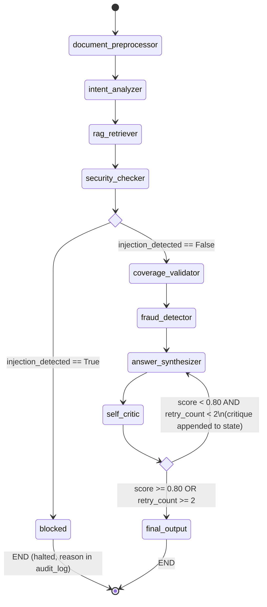

# LangGraph Workflow

## 1. StateGraph node/edge diagram



## 2. Conditional routing — implementation contract

Two conditional edges exist in this graph. Both are implemented as pure functions in `agents/routing.py` that read `GraphState` and return a string naming the next node — LangGraph's standard `add_conditional_edges` pattern. Neither routing function itself calls an LLM; the *decision* that feeds the routing was already computed by the preceding node (`security_checker` or `self_critic`), so routing is just reading a flag. This keeps control flow inspectable and unit-testable without mocking an LLM.

### `route_after_security(state) -> Literal["coverage_validator", "blocked"]`
```
if state.injection_detected:
    return "blocked"
return "coverage_validator"
```
`blocked` is a terminal node that does nothing but assemble a `final_decision` with `status="blocked"`, `reason=state.security_flags`, and an audit_log entry — it still produces a well-formed response for the API to return (HTTP 200 with a blocked-status payload, not a 500), because "the pipeline was blocked" is an expected, correctly-handled outcome, not an application error.

### `route_after_critic(state) -> Literal["answer_synthesizer", "final_output"]`
```
if state.critic_score >= 0.80:
    return "final_output"
if state.retry_count >= 2:
    state.low_confidence = True
    return "final_output"
return "answer_synthesizer"   # retry
```

## 3. The retry loop — how the spec's "common mistake" is structurally avoided

The spec calls out the exact failure mode to avoid: *"Retrying with the same prompt → produces the same result, infinite loop."* Two independent guarantees prevent this, and they're independent on purpose (either one failing shouldn't be able to cause an infinite loop):

1. **Critique injection is a state-write, not a side-channel.** `self_critic` writes `state.critique` (the specific reasons the score was low) as a first-class field. `answer_synthesizer`'s prompt template unconditionally includes `{critique}` when it is non-empty — it is not optional context the model might ignore; the prompt structure changes on retry (an added "Address the following issues from the previous attempt" section), so the second call is materially different from the first. This satisfies *"Self-Critic injects critique into Synthesizer on retry (not silently discarded)"* as a structural property of the prompt template, not a hope that the model reads it.
2. **`retry_count` is incremented by the routing function itself, before the edge is taken**, not by the node it routes to — so there is no path through the graph that reaches `answer_synthesizer` a second time without `retry_count` having already been incremented. The guard is checked *before* the retry edge fires (`retry_count >= 2` short-circuits back to `final_output` regardless of score), which is what caps this at exactly 2 retries (3 total synthesis attempts) rather than depending on the model eventually scoring itself well.

If the cap is hit, `low_confidence=True` is set unconditionally — the pipeline always terminates with a well-formed decision, never with an unresolved loop or a silent failure.

## 4. Why `retrieved_chunks` is fetched once (step 3) and reused by steps 5–8

RAG Retriever runs once, early, and its output (`retrieved_chunks`) is treated as immutable for the remainder of the run. Coverage Validator, Fraud Detector, and Answer Synthesizer all consume it but none re-query the vector store. This is both a cost control (one retrieval pass instead of four) and a grounding control: Answer Synthesizer's acceptance criterion is *"justification must cite only from retrieved_chunks — no external knowledge"* — if each downstream node could issue its own retrieval, the citation surface would be inconsistent between what Coverage Validator cited and what Synthesizer cited for the same claim. A single shared retrieval set is the only way to guarantee those two agents are reasoning over the same evidence.

The one exception is the **dispute flow** (see [memory-architecture.md](./memory-architecture.md)), which may issue *additional* targeted retrievals if the claimant references something outside the original `retrieved_chunks` — that's a different graph (`dispute_graph`), not a re-entry into this one.

## 5. Parallel execution (stretch goal) — deliberately deferred, not implemented in the base graph

The spec lists "Coverage Validator + Fraud Detector run in parallel via LangGraph Send API" as a stretch goal. The base graph wires them sequentially (`coverage_validator → fraud_detector`) because Fraud Detector's prompt is designed to take `coverage_map` as input context (upcoding detection specifically compares the *validated* CPT/diagnosis pairing against billed codes — it's cheaper and more accurate to reuse Coverage Validator's normalization than to redo it). Parallelizing them would require Fraud Detector to either duplicate that normalization or run on raw claim data with weaker signal. If pursued as a stretch goal, the correct fan-out point is *before* both — parallelizing on `retrieved_chunks` as shared read-only input to two independent nodes that fan back in via `Send` — not parallelizing the current sequential dependency. This is noted here so the decision isn't silently revisited under time pressure without the reasoning that led to sequential-by-default.
