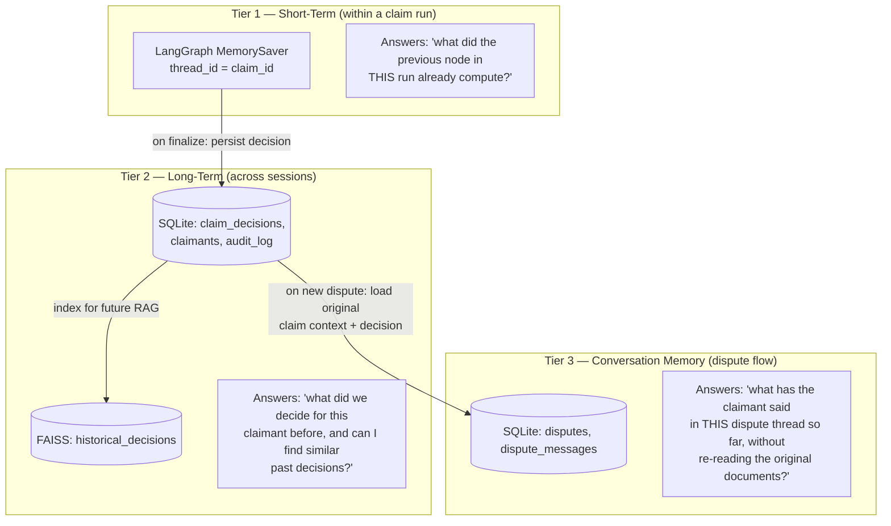
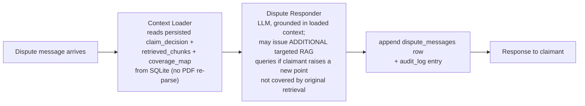

# Memory Architecture

Three distinct memory tiers exist because they answer three different questions with three different lifetimes. Collapsing them into one mechanism (e.g., trying to make the LangGraph checkpointer also serve as the queryable claimant history) was considered and rejected — reasoning below.

## 1. Short-term: LangGraph `MemorySaver`

Per spec, `MemorySaver` is the checkpointer for state persisting *between nodes within one claim's processing run*. `thread_id` is set to the `claim_id` for every graph invocation — this is what makes the self-critic retry loop work correctly: when `route_after_critic` sends execution back to `answer_synthesizer`, it's a re-entry into the *same thread*, so the full accumulated state (`coverage_map`, `fraud_signals`, `retrieved_chunks`, the new `critique`) is available without anything being re-fetched, satisfying *"no agent re-fetches data that a previous agent already produced."*

`MemorySaver` is in-process memory — it does not survive a server restart. This is acceptable and intentional at this scope: a run that's interrupted mid-pipeline by a server restart is re-submitted, not resumed, because there's no meaningful partial result to resume from (an unfinished claim decision isn't a valid state to hand back to a user). The upgrade path if this changed (e.g., needing to survive deploys mid-run) is swapping in `SqliteSaver` from `langgraph-checkpoint-sqlite` — a constructor change in `memory/checkpointer.py`, not an architecture change, because `claim_service.py` only depends on the `BaseCheckpointSaver` interface.

## 2. Long-term: SQLite + `historical_decisions` FAISS index

This is a genuinely different problem from Tier 1: *"claimant can return to dispute a prior decision — history must be retrievable by claimant ID"* is an **exact-match lookup by a business key**, not a "resume this exact run" problem. That's what SQL is for — `GET /claimants/{claimant_id}/history` is a straightforward indexed query against `CLAIMS`/`CLAIM_DECISIONS`, not a vector search. The `historical_decisions` FAISS index exists for a separate purpose: giving the RAG Retriever *semantic* access to how similar past claims were decided, which is one of the three required RAG sources — that's a similarity question ("what looks like this claim"), not an identity question ("what did this specific claimant file"), which is why both a SQL path and a vector path exist side by side rather than picking one.

## 3. Conversation memory: the dispute flow

The spec's requirement is explicit and structurally important: *"Must retain full claim context — no re-processing the original documents."* This is why disputes are **not** a re-entry into the main 9-node graph. A dispute is handled by a separate, small `dispute_graph`:

Two things are worth calling out explicitly:
- **The original claim documents are never re-parsed or re-run through Document Preprocessor / Security Checker.** The `dispute_graph` reads the *already-validated, already-redacted* `retrieved_chunks` and `coverage_map` that were persisted when the original decision finalized. This is a meaningful safety property too, not just an efficiency one: Security Checker already cleared this content once; re-running the injection-detection gate on every dispute message would be redundant, but re-parsing the raw original PDF *would* reintroduce the exact risk that gate was there to close.
- **The Context Loader can still issue new RAG queries** (e.g., a claimant disputing a denial might ask about a specific policy clause never retrieved originally) — "no re-processing the original documents" is about not re-parsing the claimant's uploaded files, not about freezing the pipeline's ability to look things up. Any newly retrieved chunks are tagged and appended to that dispute thread's context, not merged back into the original claim's `retrieved_chunks` — the original decision's evidentiary record stays exactly as it was when finalized, which matters if this decision is ever audited.

Every dispute message, both the claimant's and the assistant's reply, is appended to `audit_log` with a timestamp — this is the same `append_audit()` helper the main graph's nodes use, so the Audit Trail screen shows one continuous, chronologically ordered record spanning the original 9-agent run and any subsequent dispute activity.

## 4. Why this three-tier split doesn't cost extra complexity

Each tier already had to exist for an unrelated reason — `MemorySaver` because LangGraph requires *some* checkpointer to support conditional retry edges at all; SQLite because the API needs to serve `GET /claims/{id}/decision` after the process that computed it may have moved on to other requests; the dispute graph because "don't re-process documents" is a hard requirement. The tiers aren't three separate systems bolted on for completeness — they're the minimum each already-necessary piece needs to do its one job.
