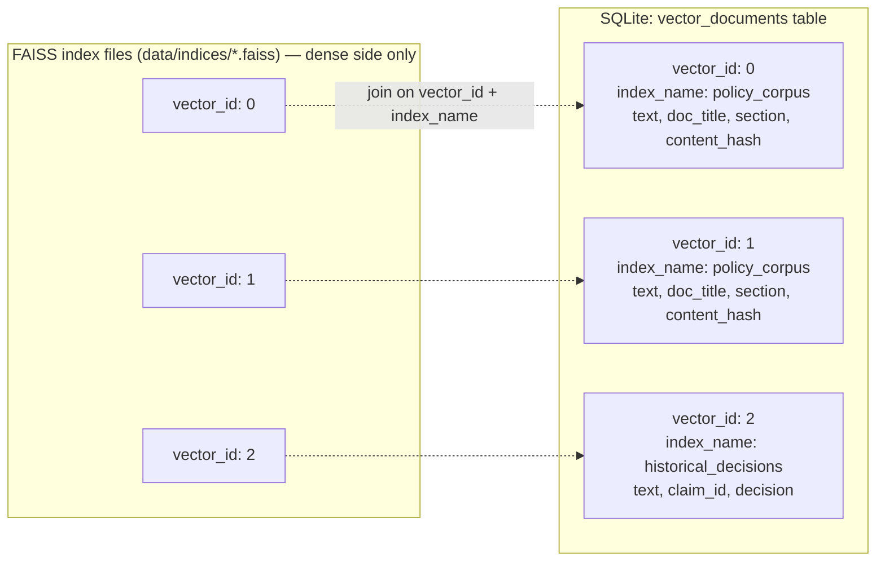
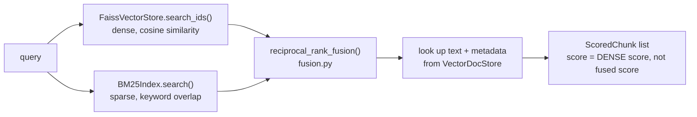
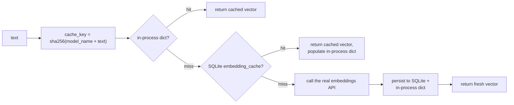
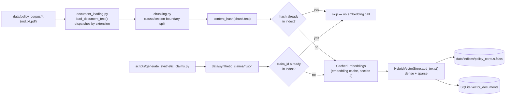

# Vector DB Architecture

## 1. Why FAISS, and why three separate indices instead of one

**FAISS over Chroma:** this corpus is small (six policy documents chunked by clause, a generated set of synthetic historical decisions, and one claim's documents per run — realistically low hundreds to low thousands of vectors total). FAISS needs no server process, ships as a pure library dependency, and its index files are trivial to build deterministically from a script and check into `.gitignore`'d build output. Chroma's added value (a persistence server, native metadata filtering, incremental collections) solves problems this project doesn't have at this scale. The trade-off is explicit: FAISS has no native metadata filtering, which is why a companion metadata store is required (below) — that's a small, well-understood cost against Chroma's heavier operational footprint.

**Three logical indices, not one index with a metadata filter column:**

| Index | Contents | Lifecycle | Persisted? |
|---|---|---|---|
| `policy_corpus` | Clause-level chunks of the 6 public policy documents | Built/updated incrementally by `scripts/build_policy_index.py` (see section 5) | Yes — committed build artifact path, gitignored contents, rebuilt in CI/setup |
| `per_claim` | Chunks of the documents uploaded for *this* claim | Built fresh at Document Preprocessor time, held for the duration of one run | No — in-memory only, discarded when the run ends |
| `historical_decisions` | Finalized decisions + justifications from prior claims | Appended to incrementally after every `final_output` (non-blocked) run | Yes — grows over time, persisted to disk |

These are separate index objects rather than one index with a `source_type` metadata filter because filtering-by-metadata means retrieving a larger-than-needed `k` and filtering post-hoc in Python — with three sources of very different sizes and update cadences (one incrementally-grown, one ephemeral, one append-only), that post-hoc filtering ratio would be unpredictable and the RAG Retriever's *"configurable similarity threshold"* requirement is cleaner to reason about per-source than against a blended top-k. It also means `per_claim`'s ephemeral, PII-adjacent vectors are never at risk of leaking into the persisted `historical_decisions` index by a filtering bug — they're physically different index objects.

**Why `per_claim` is never persisted:** it's built from the raw uploaded document before Security Checker's PII redaction pass has run (RAG Retriever is node 3, Security Checker is node 4 — see [langgraph-design.md](./langgraph-design.md)). Keeping it in-memory-only for the run's lifetime means there is no on-disk artifact containing unredacted claim content that could outlive the request. Only the *finalized, already-redacted* decision and justification get written to `historical_decisions`.

## 2. Vector + metadata pairing

FAISS stores vectors and integer IDs only — it has no concept of the source text or metadata (chunk source, section, document title, claim_id, content hash). Rather than a parallel JSON file per index (which risks drifting out of sync with the FAISS file if one is updated and not the other), metadata lives in the same SQLite database as everything else, in one table (`vector_documents`, via `app.memory.vector_doc_store.SqlVectorDocStore`):

Index type is `IndexFlatIP` (exact inner-product search over L2-normalized embeddings, i.e. cosine similarity) wrapped in `IndexIDMap2` so vector IDs are stable and match SQLite primary keys, and so `historical_decisions` supports incremental `add` without rebuilding the whole index. Flat/exact search, not an approximate index (IVF/HNSW/PQ), is the right choice at this corpus size — approximate search trades recall for speed, and at low thousands of vectors, exact search is already sub-millisecond, so there is nothing to trade. **Scalability note, not a current requirement:** if `historical_decisions` grew to 100k+ vectors in a production deployment, this is the one line that would change (`IndexFlatIP` → `IndexIVFPQ`); nothing else in the retrieval interface would need to change, because `VectorStore` (`app/vectorstore/base.py`) exposes `search(query, k, threshold, source_label) -> list[ScoredChunk]` and doesn't leak the index implementation.

## 3. Hybrid retrieval — dense + sparse, fused with RRF

`FaissVectorStore` (pure dense, cosine similarity) is composed with a `BM25Index` (sparse, keyword — `app/vectorstore/bm25_index.py`, via [`rank_bm25`](https://pypi.org/project/rank-bm25/)) inside `HybridVectorStore` (`app/vectorstore/hybrid_store.py`), which is what every part of the app actually uses — `FaissVectorStore` is no longer used directly outside of `HybridVectorStore`'s own composition.

**Why hybrid, not dense alone:** dense embeddings are strong at semantic similarity but weak at exact-term matches — a CPT code like `97110`, a statute citation like `10 CCR §2695`, or an uncommon proper noun can get diluted in a dense vector alongside the surrounding prose. BM25 is the reverse: exact/near-exact term overlap, no semantic understanding. A claims pipeline needs both — "what does my policy say about ambulatory care" is a semantic query, "what does CPT 97140 mean" is a keyword query — so retrieval defaults to combining them rather than picking one.

**Why Reciprocal Rank Fusion (RRF), not a weighted score average:** dense cosine similarity (bounded, roughly 0–1) and BM25 scores (unbounded, corpus-size-dependent) are not on a comparable scale, so averaging or weighting them directly is not principled — a BM25 score of `1.6` isn't "1.6× as relevant" as a cosine score of `0.8` in any meaningful sense. RRF sidesteps this entirely: it only uses each ranking's *rank order* (`fused_score(id) = Σ 1/(k + rank + 1)` across every ranking the id appears in), which is why it's the standard fusion method for dense+sparse hybrid search (Cormack, Clarke & Buettcher, SIGIR 2009). `k=60` is the paper's own recommended constant — not tuned against this corpus, since [the evaluation harness](#6-evaluation-harness) that would make tuning meaningful is new itself.

**Why `low_confidence` is still based on the dense score, not the fused RRF score:** the configurable `similarity_threshold` is calibrated in cosine-similarity terms specifically, and RRF scores aren't on that scale. A chunk surfaced only by the BM25 side (no meaningful dense similarity at all) is treated as `dense_score = 0.0` for this purpose — i.e. flagged low-confidence — since "found only by exact keyword match, not by semantic similarity" is exactly the situation that flag exists to surface. See `HybridVectorStore`'s module docstring for the full reasoning.

**Why BM25 is never persisted to disk:** it's rebuilt in-memory from `VectorDocStore.get_all(index_name)` every time `HybridVectorStore.load_or_create()` runs (once, at process startup) — the source texts are already durably stored in SQLite, so serializing a second copy in a BM25-specific format would be redundant storage for no benefit at this corpus size. The cost is a full BM25 rebuild on every process start, which is fast (milliseconds) at this scale — `rank_bm25` itself has no incremental-add API, so a batch rebuild is the only option regardless, and it's cheaper to do that rebuild once at startup than to also maintain a serialization format for it.

## 4. Embedding cache

`CachedEmbeddings` (`app/vectorstore/embedding_cache.py`) wraps the real embeddings client with a two-tier cache — an in-process dict (fastest, cleared on restart) in front of a persistent, SQLite-backed store (`EmbeddingCacheRecord` / `SqlEmbeddingCacheStore`) — and is what every part of the app actually receives from `get_embeddings()`'s call sites (`main.py`, both ingestion scripts, the evaluation script).

**Why the cache key includes the model name:** different embedding models produce different, non-comparable vectors for identical text. A cache keyed on text alone would silently serve a `text-embedding-3-small` vector to code expecting a different model's output if `LLM_PROVIDER`/embedding configuration ever changed — the model name is part of the hash specifically to make that impossible rather than merely unlikely.

**What this actually saves:** re-running an ingestion script over an unchanged corpus (development iteration, CI), the same claim document text recurring across a dispute thread and the original run, and repeated `scripts/evaluate_retrieval.py` runs during tuning — all become free (cache hits) instead of re-paying the embeddings API for identical text. This is a pure cost/latency optimization; it never changes what a call returns; see the module's own docstring and `tests/unit/test_embedding_cache.py` for the "cache hit avoids the real call" assertions this is built to satisfy, not just "returns the right value."

## 5. Ingestion pipeline — multi-format, incremental

**Multi-format loading (`app/vectorstore/document_loading.py`):** `load_document_text()` dispatches on file extension — `.md`/`.txt` read directly, `.pdf` via PyMuPDF — and raises `ValueError` for anything unsupported rather than silently skipping it (an ingestion script should fail loudly on an unrecognized file, not produce a corpus with an inexplicable gap). This is the same function `app.agents.nodes.document_preprocessor` uses for claim-document PDF extraction — one implementation of "how do we get text out of a PDF," shared rather than duplicated between the claim-processing path and the corpus-ingestion path.

**Incremental indexing, genuinely (not just idempotent-by-claim):** both `scripts/build_policy_index.py` and `scripts/generate_synthetic_claims.py` compute a dedup key before embedding — a content hash of the chunk text for the policy corpus (a chunk's identity is its content), and `claim_id` for synthetic claims (identity is the record, not the text) — and check it against `VectorDocStore.get_all(index_name)`'s existing metadata before calling `add_texts`. A re-run after adding one new policy document only embeds that document's chunks; every other file's chunks are skipped, not re-embedded and re-added as duplicates. This was verified directly (not just asserted): a first run against the real six-document corpus indexed 39 chunks, and an immediate second run detected and skipped all 39 with zero new embeddings calls.

This is a correction, not just an addition: an earlier version of this ingestion script called itself "idempotent" in a comment while actually re-adding every chunk as a duplicate on every run — the claim was aspirational, not enforced by the code. The content-hash dedup here is what actually makes it true.

## 6. Evaluation harness

`scripts/evaluate_retrieval.py` runs a fixed set of realistic queries (`EVAL_QUERIES`) against the `policy_corpus` index, each with a known expected source document, and reports a recall@k proxy: did the expected document appear in the top-k results. It runs every query through **both** `store.search()` (hybrid) and `store.search_dense_only()` (dense-only baseline — a method that exists solely for this comparison, bypassing fusion) and reports both, so hybrid retrieval's actual effect on this corpus is visible in the report rather than merely asserted in a docstring.

This is deliberately not a full RAGAS-style evaluation framework — there is no labeled, human-curated retrieval dataset for six representative policy documents, so a heavyweight framework would be measuring against a target that doesn't exist. The scoring function (`evaluate_query()`) is a pure function taking a bound search callable rather than a store object, specifically so it's unit-testable (`tests/unit/test_...` fakes a search function) without needing a real embeddings API call — the script's `main()` is thin wiring on top of that pure function, matching the same "pure function does the work, main() only constructs dependencies" pattern used throughout the ingestion scripts.

## 7. Retrieval and merge (RAG Retriever node)

The RAG Retriever queries `policy_corpus`, `per_claim`, and `historical_decisions` independently (each now hybrid — section 3) with the same query text, then merges results with source metadata attached to every chunk — this is the acceptance criterion *"RAG retrieves from all three sources with source metadata attached"* made concrete: the merge step does not flatten source information away, `retrieved_chunks` is a list of `{text, source: "policy_corpus" | "claim_document" | "historical_decision", score, section, doc_title, low_confidence}`, carried through to Coverage Validator and Answer Synthesizer so citations can distinguish *"policy says X"* from *"a prior similar claim was decided Y."*

The **similarity threshold is a config value** (`RAG_SIMILARITY_THRESHOLD` in `config.py`, not hardcoded), and results below it are not dropped silently — they're retained in `retrieved_chunks` with `low_confidence=True` set at the chunk level, so downstream agents (and ultimately Self-Critic) can see that a citation is weakly grounded rather than treating a low-confidence match identically to a strong one. This directly satisfies *"low-confidence matches must be flagged, not silently included."*
