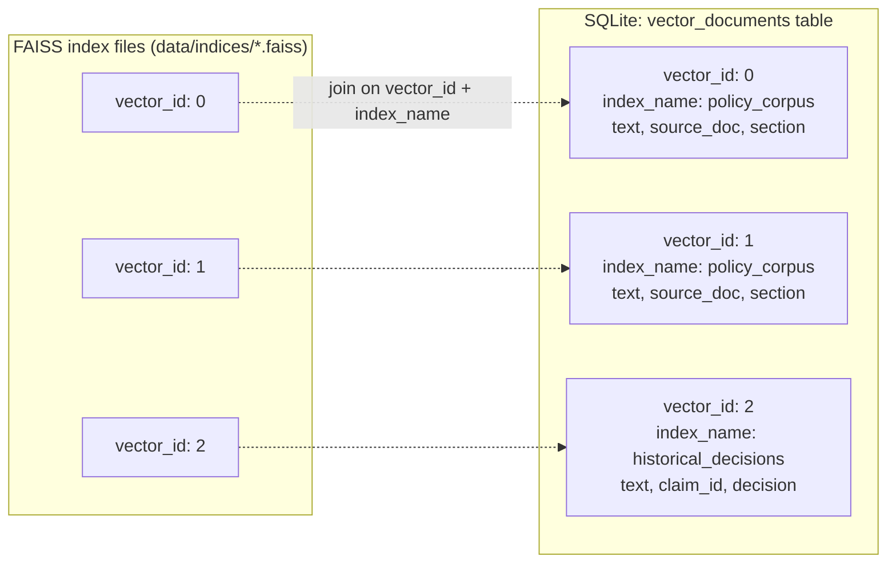
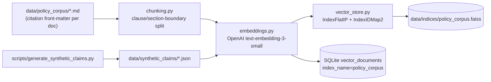

# Vector DB Architecture

## 1. Why FAISS, and why three separate indices instead of one

**FAISS over Chroma:** this corpus is small (six policy documents chunked by clause, a generated set of synthetic historical decisions, and one claim's documents per run — realistically low hundreds to low thousands of vectors total). FAISS needs no server process, ships as a pure library dependency, and its index files are trivial to build deterministically from a script and check into `.gitignore`'d build output. Chroma's added value (a persistence server, native metadata filtering, incremental collections) solves problems this project doesn't have at this scale. The trade-off is explicit: FAISS has no native metadata filtering, which is why a companion metadata store is required (below) — that's a small, well-understood cost against Chroma's heavier operational footprint.

**Three logical FAISS indices, not one index with a metadata filter column:**

| Index | Contents | Lifecycle | Persisted? |
|---|---|---|---|
| `policy_corpus` | Clause-level chunks of the 6 public policy documents | Built once by `scripts/build_policy_index.py`; rebuilt only when source corpus changes | Yes — committed build artifact path, gitignored contents, rebuilt in CI/setup |
| `per_claim` | Chunks of the documents uploaded for *this* claim | Built fresh at Document Preprocessor time, held for the duration of one run | No — in-memory only, discarded when the run ends |
| `historical_decisions` | Finalized decisions + justifications from prior claims | Appended to after every `final_output` (non-blocked) run | Yes — grows over time, persisted to disk |

These are separate FAISS index objects rather than one index with a `source_type` metadata filter because FAISS filtering-by-metadata means retrieving a larger-than-needed `k` and filtering post-hoc in Python — with three sources of very different sizes and update cadences (one static, one ephemeral, one append-only), that post-hoc filtering ratio would be unpredictable and the RAG Retriever's *"configurable similarity threshold"* requirement is cleaner to reason about per-source than against a blended top-k. It also means `per_claim`'s ephemeral, PII-adjacent vectors are never at risk of leaking into the persisted `historical_decisions` index by a filtering bug — they're physically different index objects.

**Why `per_claim` is never persisted:** it's built from the raw uploaded document before Security Checker's PII redaction pass has run (RAG Retriever is node 3, Security Checker is node 4 — see [langgraph-workflow.md](./langgraph-workflow.md)). Keeping it in-memory-only for the run's lifetime means there is no on-disk artifact containing unredacted claim content that could outlive the request. Only the *finalized, already-redacted* decision and justification get written to `historical_decisions`.

## 2. Vector + metadata pairing

FAISS stores vectors and integer IDs only — it has no concept of the source text or metadata (chunk source, section, document title, claim_id). Rather than a parallel JSON file per index (which risks drifting out of sync with the FAISS file if one is updated and not the other), metadata lives in the same SQLite database as everything else, in one table:

Index type is `IndexFlatIP` (exact inner-product search over L2-normalized embeddings, i.e. cosine similarity) wrapped in `IndexIDMap2` so vector IDs are stable and match SQLite primary keys, and so `historical_decisions` supports `add` without rebuilding the whole index. Flat/exact search, not an approximate index (IVF/HNSW/PQ), is the right choice at this corpus size — approximate search trades recall for speed, and at low thousands of vectors, exact search is already sub-millisecond, so there is nothing to trade. **Scalability note, not a current requirement:** if `historical_decisions` grew to 100k+ vectors in a production deployment, this is the one line that would change (`IndexFlatIP` → `IndexIVFPQ`); nothing else in the retrieval interface would need to change, because `vector_store.py` exposes a `search(query_vector, k, threshold) -> list[ScoredChunk]` protocol that doesn't leak the index implementation.

## 3. Ingestion pipeline

`build_policy_index.py` and `generate_synthetic_claims.py` are idempotent — running them again against unchanged source data reproduces the same index (assuming a deterministic embedding model), so the build step is safe to re-run in setup instructions without special-casing "already built."

## 4. Retrieval and merge (RAG Retriever node)

The RAG Retriever queries `policy_corpus`, `per_claim`, and `historical_decisions` independently with the same query embedding, then merges results with source metadata attached to every chunk — this is the acceptance criterion *"RAG retrieves from all three sources with source metadata attached"* made concrete: the merge step does not flatten source information away, `retrieved_chunks` is a list of `{text, source: "policy_corpus" | "claim_document" | "historical_decision", score, section, doc_title}`, carried through to Coverage Validator and Answer Synthesizer so citations can distinguish *"policy says X"* from *"a prior similar claim was decided Y."*

The **similarity threshold is a config value** (`RAG_SIMILARITY_THRESHOLD` in `config.py`, not hardcoded), and results below it are not dropped silently — they're retained in `retrieved_chunks` with `low_confidence_retrieval=True` set at the chunk level, so downstream agents (and ultimately Self-Critic) can see that a citation is weakly grounded rather than treating a low-confidence match identically to a strong one. This directly satisfies *"low-confidence matches must be flagged, not silently included."*
